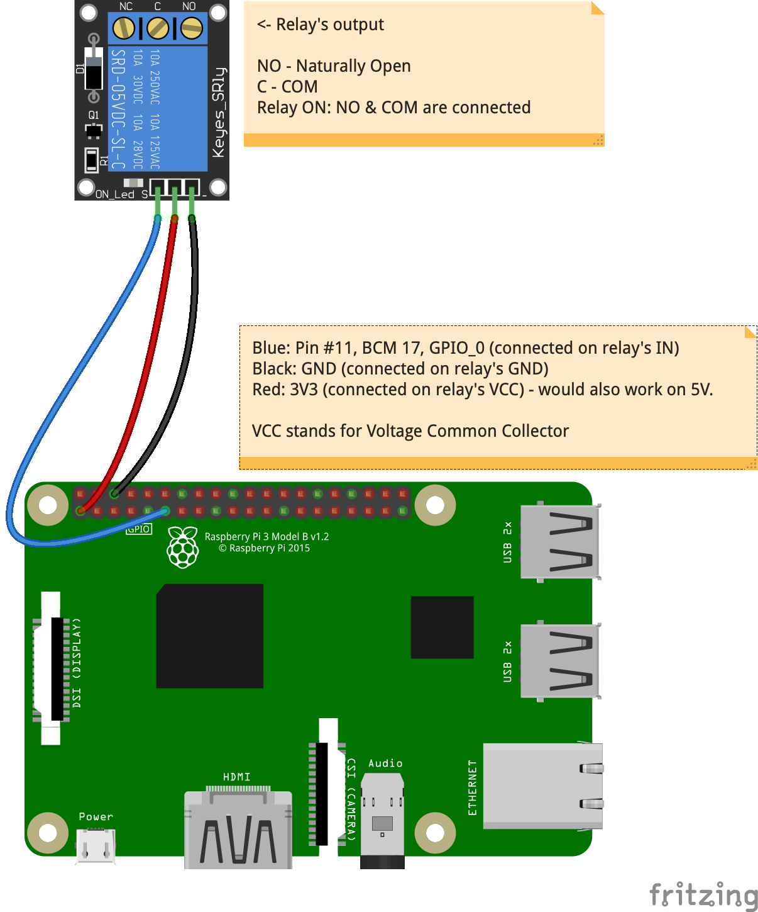

## REST Relay

Simple example showing:
- How to interact with a Relay
- How to expose the relay to a REST Server
- How to interact with the REST Server to turn the relay on or off
  - From a Web Client
  - A Smart Watch
  - An ESP8266
  - And whatever understands the REST protocol...

---

### Wiring


Wiring between the Raspberry Pi and the Relay.


How to hook up the power and appliance to the relay.  
The yellow socket will be plugged in the wall.  
Your appliance will be plugged on the white socket.

> Note:
> - On a one-relay board, I use the 3V3 power supply from the Raspberry Pi.
> - On a two-relay board, I use the 5V power supply from the Raspberry Pi.

### Relay mapping
The code in this project can drive several relays.

The limit is the number of GPIO pins available on the Raspberry Pi header.

The relays will be identified by an integer.

The `RelayRequestManager` will establish the mapping between the relay number (`id`) and
the GPIO pin driving it. The "map" is provided as a System Property provided at runtime, like in `start.server.sh`:

```
 -Drelay.map=1:11,2:12
```

The variable is made of elements `ID:PIN` separated by a comma.

The `PIN` is the **physical** number of the pin.

The semantic is the following one:
```
  -Drelay.map=1:11,2:12
              | |  | |
              | |  | Physical pin #12 (GPIO_1)
              | |  Relay num for this app
              | Physical pin #11 (GPIO_0)
              Relay num for this app
```

The default value for this `relay.map` variable is the one above: `1:11,2:12`.

This means that
- Relay `1` will be driven by the `GPIO_0` pin
- Relay `2` will be driven by the `GPIO_1` pin

The REST requests are defined `RESTImplementation` :
- `GET` `/relay/status/{relay-id}`
- `POST` `/relay/status/{relay-id}`

The `{relay-id}` is the ID of the relay (`1` or `2` in the above), it is provided as a path parameter in the REST request.

#### GPIO Header
See below:

The pin #11 is BCM 17, and GPIO_0.

```
       +-----+-----+--------------+-----++-----+--------------+-----+-----+
       | BCM | wPi | Name         |  Physical  |         Name | wPi | BCM |
       +-----+-----+--------------+-----++-----+--------------+-----+-----+
       |     |     | 3v3          | #01 || #02 |          5v0 |     |     |
       |  02 |  08 | SDA1         | #03 || #04 |          5v0 |     |     |
       |  03 |  09 | SCL1         | #05 || #06 |          GND |     |     |
       |  04 |  07 | GPCLK0       | #07 || #08 |    UART0_TXD | 15  | 14  |
       |     |     | GND          | #09 || #10 |    UART0_RXD | 16  | 15  |
       |  17 |  00 | GPIO_0       | #11 || #12 | PCM_CLK/PWM0 | 01  | 18  |
       |  27 |  02 | GPIO_2       | #13 || #14 |          GND |     |     |
       |  22 |  03 | GPIO_3       | #15 || #16 |       GPIO_4 | 04  | 23  |
       |     |     | 3v3          | #17 || #18 |       GPIO_5 | 05  | 24  |
       |  10 |  12 | SPI0_MOSI    | #19 || #20 |          GND |     |     |
       |  09 |  13 | SPI0_MISO    | #21 || #22 |       GPIO_6 | 06  | 25  |
       |  11 |  14 | SPI0_CLK     | #23 || #24 |   SPI0_CS0_N | 10  | 08  |
       |     |     | GND          | #25 || #26 |   SPI0_CS1_N | 11  | 07  |
       |     |  30 | SDA0         | #27 || #28 |         SCL0 | 31  |     |
       |  05 |  21 | GPCLK1       | #29 || #30 |          GND |     |     |
       |  06 |  22 | GPCLK2       | #31 || #32 |         PWM0 | 26  | 12  |
       |  13 |  23 | PWM1         | #33 || #34 |          GND |     |     |
       |  19 |  24 | PCM_FS/PWM1  | #35 || #36 |      GPIO_27 | 27  | 16  |
       |  26 |  25 | GPIO_25      | #37 || #38 |      PCM_DIN | 28  | 20  |
       |     |     | GND          | #39 || #40 |     PCM_DOUT | 29  | 21  |
       +-----+-----+--------------+-----++-----+--------------+-----+-----+
       | BCM | wPi | Name         |  Physical  |         Name | wPi | BCM |
       +-----+-----+--------------+-----++-----+--------------+-----+-----+
```

## Run it!
- Hook up your relay to the Raspberry Pi and the appliance to the relay (a desk lamp is a good appliance 👍).
- Modify `start.server.sh` to map the relay accordingly, and set the HTTP port.
- Then, from any browser on a laptop, tablet, cellphone..., reach `http://192.168.42.9:9876/web/index.2.html` (`192.168.42.9` is the address of the Raspberry Pi the server runs on).

The switch is mapped to the relay `1`.


And flip the switch! 💡

### Watch interface
The watch project's code is [here](https://github.com/OlivierLD/SmartWatches/tree/master/SamsungFrontier/RESTSwitch30).
> Note:
> - Requires a Samsung Frontier watch (~$200) the Tizen IDE (free).
> - The server URL is hard-coded.

Samsung Frontier (Emulator screenshots):

|    First Screen     |   Working Screen    |
|:------------------- |:------------------- |
|  |  |

### ESP8266 (Adafruit Feather Huzzah)
ESP8266 is a Wi-Fi aware PCB, programmable with the Arduino IDE.

Adafruit provide the `Huzzah` PCB, that implements an `ESP8266`, and the Feather, even easier to use.

- [Feather](https://www.adafruit.com/product/2821)
- [SSD1306 Oled](https://www.adafruit.com/product/2900)

The project's code is [here](https://github.com/OlivierLD/small-boards/tree/master/ESP8266.Huzzah/feather.ssd1306.home.automation.client).
> Note: The server URL is hard coded in the sketch.

| Welcome Screen |
|:-------------- |
|  |
| Operations     |
|  |
| The real one   |
|  |

--------------------
