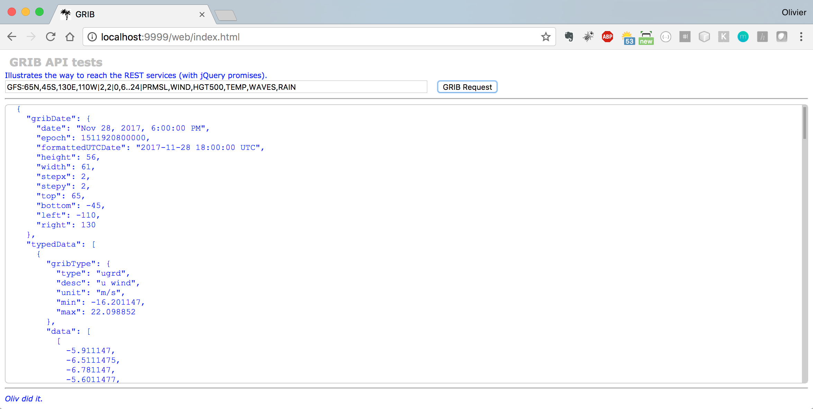

## GRIB Reader
And routing.

The server generates a json document, as in `GRIBBulk`.
The rendering is (to be) done on the client (HTML5/CSS) over a map. See in `RESTNavServer/web`.

And later, add the faxes.

Run `./runGRIBserver`:

### TODO
- GRIB Request generator ?
- Routing
