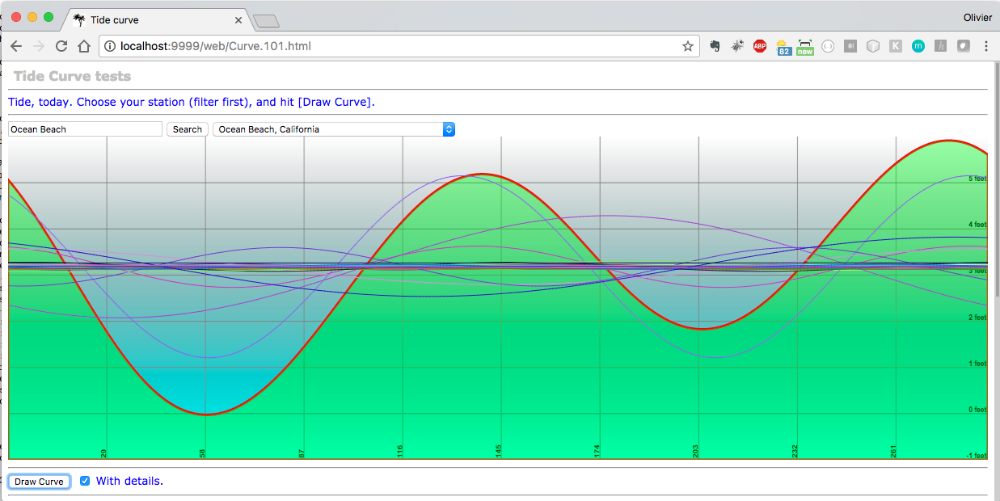
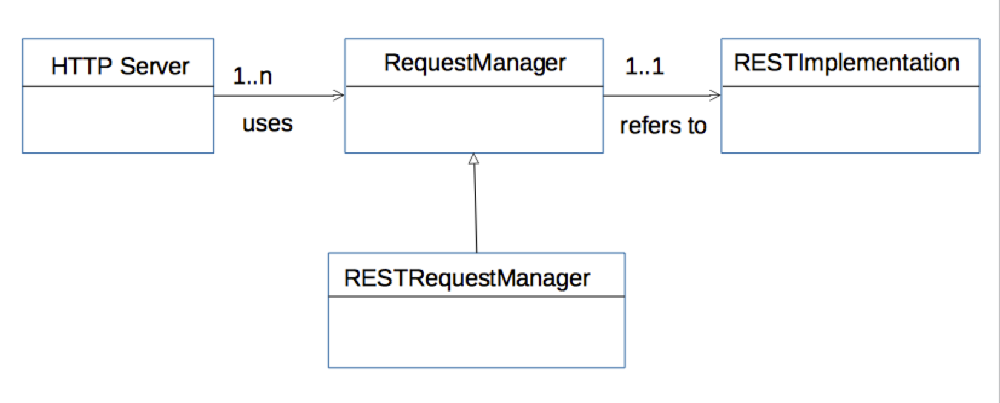
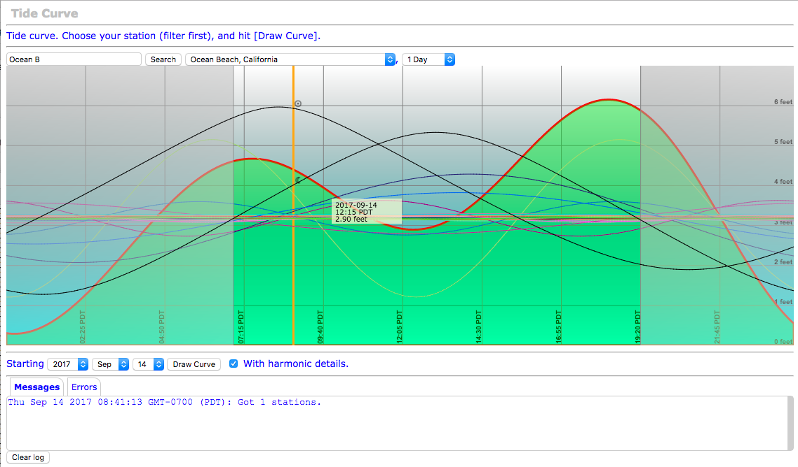
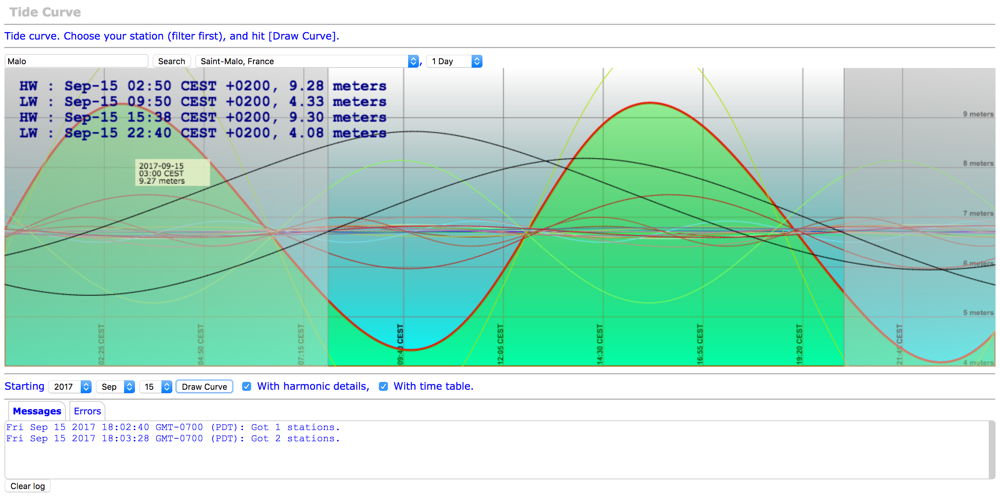
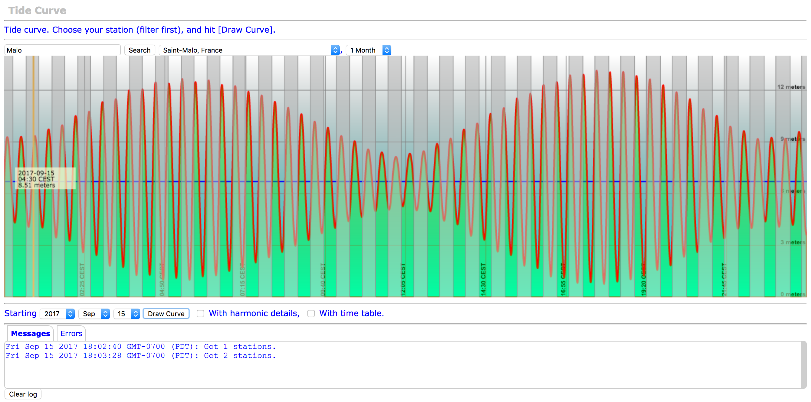
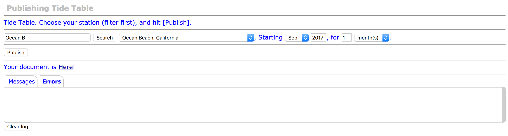
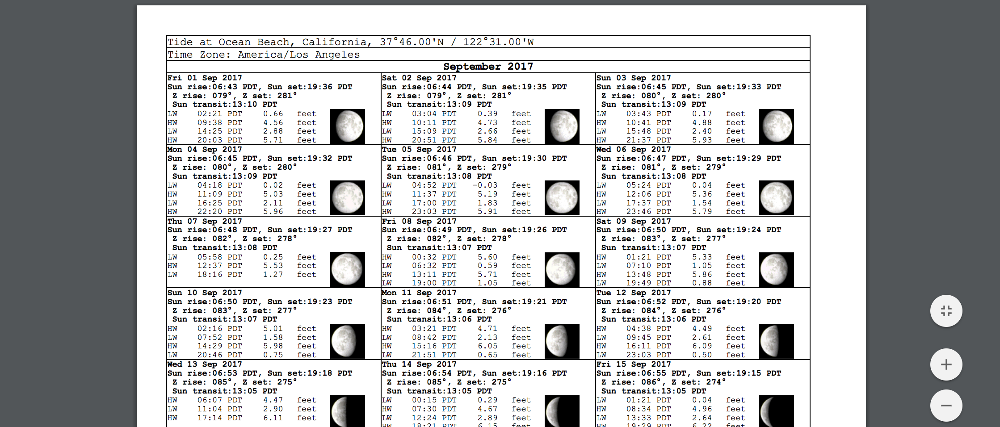
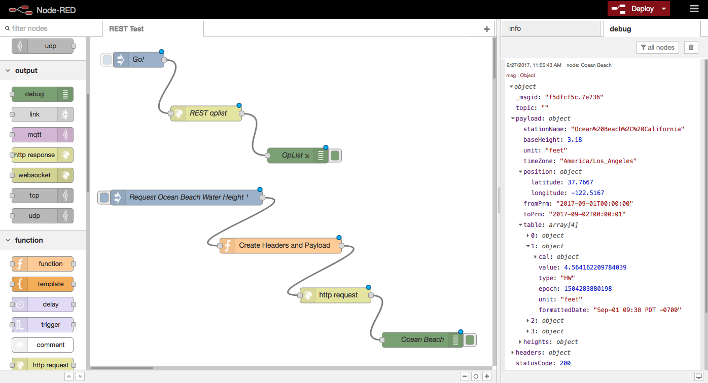

## REST Tide Engine

This project intends to be a Proof of Concept.

This is a tentative Tide Application, based on Server-Side Java implementing REST APIs for a Tide Computer.
The rendering will be done through HTML5 and JavaScript querying the REST APIs.

If that one works, then we can really move away from Swing.

```
 /GET /tide/tide-stations
 /GET /tide/tide-stations/{station}
 /POST /tide/tide-stations/{station}/wh?from=XXX&to=YYY
 /POST /tide/tide-stations/{station}/wh/details?from=XXX&to=YYY

 ... etc

```
> Warning: In the project described here, we use a REST server. It works like a REST server, but it will _not_ scale like an enterprise one. It has been designed to run on _small_ boards like the Raspberry Pi Zero, it has some limits.
> It's written in Java, but it is not a JEE Server...

#### Rationale
This starts from a simple observation. A Raspberry Pi can run on a boat, and consumes
a very small amount of energy. It can do a lot of computations, logging, and multiplexing, among many others.
It can run 24x7, without you noticing. It makes _no noise_, almost no light, and requires ridiculous amount of energy to run.
Even a Raspberry Pi Zero does this kind of job (for even less power), successfully.

One thing it is not good at is graphical UI. A graphical desktop is often too demanding on a
small board like the Raspberry Pi Zero. It becomes sometime really slow, and cumbersome.

Running on it a program like [`OpenCPN`](https://opencpn.org/) seems absurd to me.
Such a program runs fine on a bigger device, with several gigabytes of RAM available.

*But*, running a laptop 24x7 would be in many cases too demanding, specially on a sailboat, where everyone hates to run the engine ;)

I observed that at sea, I spend only a couple hours a day in front of the laptop, but it is often running by itself, doing some logging or calculations.

This is where it comes together, you could have a Raspberry Pi Zero doing logging, multiplexing and what not,
broadcasting require data on its own network (see the [NMEA Multiplexer](https://github.com/OlivierLD/raspberry-coffee/tree/master/NMEA-multiplexer) about that),
then you would use a laptop whenever necessary, connecting on the Raspberry Pi's network to get NMEA Data and more.

**In addition**, you can also use tablets and smart-phones, those devices know how to connect to a network, and have great
rendering capabilities.

_**A problem**_ is that writing a native application on those devices requires specific knowledge of the operating system,
those skills are often redundant. `iOS`, `Android`, `JavaFx`, `Swing` all have UI rendering capabilities, but they're all totally different,
and the learning curve for each of them is not always smooth.

_**A solution**_ would be to write the UI part of the applications using HTML. Whatever OS
runs on your laptop, tablet or smartphone (`Windows`, `MacOS`, `iOS`, `Linux`, `Android`, etc), you have
a browser available, supporting `HTML5` (if it does not, you should really upgrade it).

`HTML5` and `JavaScript` have been gaining a lot of momentum in the recent years, new frameworks like
`jQuery`, `ionic`, `ReactJS`, ...) appear every day, and provide really rich and nice UI.

My feeling would be to go down this route whenever possible, that would save a lot of efforts, and provide a pretty cool
Graphical User Interface (GUI). I have written a lot of GUI in Swing. It would be now time to upgrade it.
Re-writing them using JavaFX does not sound like the right choice. If I have to learn a new language to build
a modern GUI, for now I'd rather use `JavaScript` and `HTML5`. This way, the same code runs whenever a browser exists...
You have REST APIs available on the server (again, a Raspberry Pi, even the Zero does the job well), and you use AJAX and Promises to get to them from the Web UI
(WebSockets are also a realistic option, tested). The computation required to produce the payload returned by the REST services
(often in `json` format) is easily supported by a Raspberry Pi, and the complexity of the UI rendering is 100% taken care of by the browser, running
on a more powerful device.

After a 3-day week-end of work, I was able to produce a tidal graph like that one:


This is not finished, but that looks promising...

### Features
- Web UI for tidal curves
- REST APIs for server-side computation
- Publishing: Server side `pdf` generation, download from your browser

---

The engine is based on XML data, stored in `xml.zip`. Those data are generated after the
harmonic data files found in the `harmonics` directory.
 Re-generating those is not necessary, but in case you're interested, run
```bash
 $ ../gradlew --no-daemon harmonicsXML
```
The sources of the generator are obviously available.

Implements **two** REST Request Managers.
- One for tide data
- One for celestial data

#### HTTP Server, Request Manager, REST Implementation



### Why are we using XML instead of the raw `txt` file?
The format of the harmonic files is a proprietary format. To be used efficiently, the file has to
be parsed and loaded in memory for the data it contains to be available in a timely manner.

This could be quite demanding for a small machine like the Raspberry Pi (the`Zero` has "only" 512 Mb of RAM), even the generation of the XML files
can be challenging for the Raspberry Pi.

Using a SAX Parser allows the amount of required memory to substantially shrink.
As opposed to a DOM Parser that loads the DOM representation of the document in memory,
the SAX parser scans it until the expected data are found.

> Note about the encoding: The XML Data are 'ISO-8859-1' encoded. For an easier access, those
> elements (mainly the String elements, like station names) are returned as 'UTF-8' encoded by the REST API.

> See in the HTML Examples how to render the strings correctly.

### To run the examples
- Build the soft
```bash
 $ ../gradlew [--no-daemon] clean shadowJar
```
- Then start then server
```bash
 $ ./runTideServ.sh

 _/\\\\\\\\\___/\\\\\\\\___/\\\\\\\\__/\\\\\\\\\\
 _\/\\\////\\\_\/\\\////___\/\\\////__\////\\\///_
  _\/\\\___\\\__\/\\\_______\/\\\_________\/\\\____
   _\/\\\\\\\\___\/\\\\\\\\__\/\\\\\\\\____\/\\\____
    _\/\\\///\\\__\/\\\////___\//////\\\____\/\\\____
     _\/\\\_/\/\\\_\/\\\____________\/\\\____\/\\\____
      _\/\\\__\/\\\_\/\\\\\\\\\__/\\\\\\\\____\/\\\____
       _\///____\///_\/////////__\////////_____\///_____

           _/\\\\\\\\\\_/\\\__/\\\\\\\\____/\\\\\\\\_
           _\////\\\///_\/\\\_\/\\\///\\\__\/\\\////__
            ____\/\\\____\/\\\_\/\\\_\//\\\_\/\\\______
             ____\/\\\____\/\\\_\/\\\__\/\\\_\/\\\\\\\\_
              ____\/\\\____\/\\\_\/\\\__\/\\\_\/\\\////__
               ____\/\\\____\/\\\_\/\\\_\/\\\__\/\\\______
                ____\/\\\____\/\\\_\/\\\\\\\\___\/\\\\\\\\_
                 ____\///_____\///__\////////____\////////__

Starting the Tide Rest Server
Objects loaded in 1203 ms
Running on port 9999
Objects loaded in 874 ms
Using Delta-T:68.803300

```
- From a browser, access `http://host:9999/web/index.html`, where`host` is the name or IP of the machine where the server runs.



Visible on the diagram above:
- Tide at `Ocean Beach, California` for one day
- Day light
- Harmonic coefficients
- Sun and Moon Altitude
- Current time (orange vertical line)
- Tide Time Table



Tide at St Malo (France), another time zone.



One month graph, St Malo.

### Publishing
Depending on the size of the document to generate, you may experience some timeouts
from the Web UI. But you still have the possibility to use the command line interface.

#### From the Web UI
Use the page named `pub.101.html`.



Just like before, use the filter to find your station, give the period you want to document for, and hit the `publish` button.
When your document is ready, you'll see a link to download it.




#### From the Command Line Interface (cli)
`curl` is probably the easiest (and I think it even exists on Windows, I'm not 100% sure).
You need to proceed in two steps:
- Generate the document
- Download it

#### REST Clients
Any REST Client can access the services. Postman, node-red, anyone!



###### Generation
Use `POST /publish/{station name}`

Remember that `{station name}` must be escaped/encoded.

You also need a `json` payload. Here we use
```json
 {
   "startYear":2017,
   "startMonth":8,
   "nb":1,
   "quantity":"MONTH"
 }
```
> Note: the month is based on zero: Jan=0, Feb=1..., Dec=11.

Here we want the tide at `Ocean Beach, California`, starting `Sep-2017`, for 1 (`nb`) month (`quantity`).
Look into the code for details.

```bash
 $ curl -H "Content-Type: application/json" -X POST -d '{"startYear":2017,"startMonth":8,"nb":1,"quantity":"MONTH"}' http://192.168.42.1:9999/publish/Ocean%20Beach%2C%20California
```
This returns a text response like `./tide.data.2396101885014681306.pdf`, which is the name of the
temporary document generated by the command. This is the one you'll need to download next.

###### Download
Use the filename above, the `-o` switch gives the name of the file you want to save locally:
````bash
 $ curl http://192.168.42.1:9999/web/tide.data.2396101885014681306.pdf -o tide.pdf
   % Total    % Received % Xferd  Average Speed   Time    Time     Time  Current
                                  Dload  Upload   Total   Spent    Left  Speed
   100 43605  100 43605    0     0   299k      0 --:--:-- --:--:-- --:--:--  299k
 $
````
The expected file is on your machine, named `tide.pdf`.


### TODO
- Swing Implementation
- Android Implementation

---
