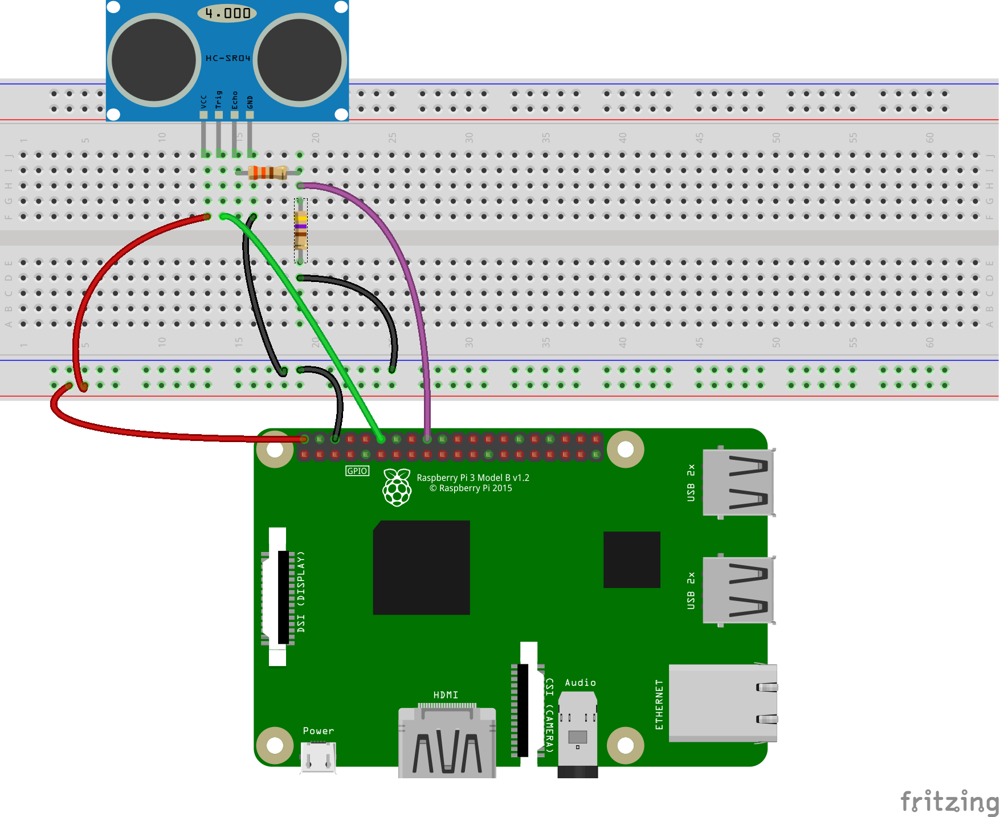

### A Java limit? the nanosecond?
This is an interesting challenge.

I was not able to have the Java code (`HC_SR04.java`) to be as efficient or performant as C, or even Python.

The class `JNI_HC_SR04.java` invokes a C implementation, and is accurate.

This device needs the nano-second precision, which is provided - but not garanteed - by Java.

Interesting.

#### Wiring

