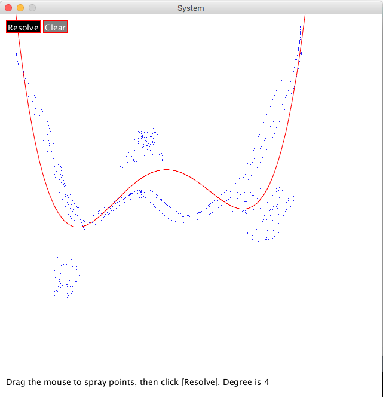

## Comparing several programming languages

This is just an example: for a given problem, provide a solution. Solutions will be implemented in different languages.

> _Note_: This document is a `KISS` document (Keep It Small and Stupid). We will _not_ provide here all you need to know to read it fluently.
> If - for example - you do not know what a compiler is, you will need to find it somewhere else.
> This being said, good luck!

### The problem to solve

> We want to solve a system of `n` equations, with `n` unknowns.
> The dimension `n` is dynamic, i.e. _not_ hard-coded,
> provided at runtime.

For example, `n` = 3, and given the system:
```
 /
 |   (12 * X)    + (13 * Y)   + (14 * Z)     = 234
 +   (1.345 * X) + (-654 * Y) + (0.001 * Z)  = 98.87
 |   (23.09 * X) + (5.3 * Y)  + (-12.34 * Z) = 9.876
 \
```
The question is: _What are the values of X, Y, and Z?_

This is - in my opinion - the kind of problems that do reveal a lot of the features of a language.
This problem implies recursive algorithms, declaring functions, functions admitting arrays (of arrays...) of parameters, etc.
In the context of this document:
- Being Object Oriented (OO) is not a requirement.
- Functionnal Programming is not a requirement.

The idea here is to be able to compare the different source codes corresponding to each language, addressing the exact same problem,
and - hopefully - returning the same result.

Comparing the length of the code, its readability, its complexity, its structure, and possibily _its beauty_
can be an interesting journey.

This document certainly does not pretend to be exhausive. There are [many languages](https://en.wikipedia.org/wiki/Category:Lists_of_programming_languages) available, I have used several of them,
but we will not talk about all of those. BASIC, COBOL, FORTRAN, Pascal, etc, are not part of this picture.

This does not mean that those languages are not interesting, this only means that this document is not an anthology of the Computer literacy.

> One of those languages though, could deserve some interest, [brainfuck](https://en.wikipedia.org/wiki/Brainfuck). It is a complete
Turing machine, using only 8 instructions. This being said, let's move on.

## System Resolution

We will use the following programming languages:
- [Java](#java)
    - Created by James Gosling, at Sun, in 1995.
    - Uses a Java Virtual Machine (JVM). 100% Object Oriented, Functional features since Java 8 (to catch up with Scala, see below). Requires compilation (`javac`). Strongly typed.
    The implementation the JVM is the key to portability. Java motto used to be _write once, run everywhere_. And this is indeed true,
    this **does** work, from single-board computers like the Raspberry PI Zero to big clusters of main-frames. Yes.
    - Java is not the first language to introduce the concept of Virtual Machine (at least ADA did it before, named afer... guess who?). But Java _specified_ it.
    This specification also includes the Java Platform Debugging Architecture (JPDA), that is a blessing for developers. _You can debug - including remotely - the same way on all systems_.
    No language - to my knowledge - ever did that before.
- [Scala](#scala)
    - Created by Martin Odersky, École Polytechnique Fédérale de Lausanne, in 2003.
    - Uses the _same_ Virtual Machine as Java (and thus gets Java protability for free), Object Oriented _and_ Functional since day one. Extremely well designed, natively implements immutability and other key concepts.
    Can sound a bit complex to a beginner, but addicting after that.
    Requires compilation (`scalac`).
- [Kotlin](#kotlin)
    - Created by the JetBrains team (author of the IntelliJ IDE, the best), in 2011.
    - Somewhat similar to `Scala`, requires compilation (`kotlinc`).
- [JavaScript](#javascript)
    - Created in 1995 by Brendan Eich, engineer at Netscape, _in 10 days_!!
    - Initially designed to run in a browser. Loosely typed (on purpose), and natively functional. Regained _a lot_ of popularity when Web 2.0 was released, used everywhere a browser runs, to program client-side applications (a **lot** of JavaScript frameworks are available).
    Interestingly, some server-side code can also be written using JavaScript, since the successful release of [`nodejs`](https://nodejs.org/).
    `NodeJS` is a JavaScript runtime built on `V8`, Chrome's JavaScript engine, open source.
    This is what makes JavaScript one of the very few languages that can be used on the client as well as on the server.
    Interpreted, does not require compilation.
- [Python](#python)
    - Created by Guido van Rossum, in 1991.
    - Designed for educational purpose. Easy to use, even if its syntax and structure might not please everyone.
    No native Object Oriented (OO) features (some exist, but they may look weird to an OO addict).
    Does not require compilation. Very popular among data scientists, mostly due to its simlicity.
- [C](#c)
    - Created by Dennis Ritchie, between 1969 and 1973, at Bell Labs.
    - Immensly adopted on the planet Earth. The oldest of all the ones mentioned here, and still alive and well.
    `C` has no OO features (its avatar `C++` does have some). No Functional Programming features.
    Requires explicit memory allocation and de-allocation (`alloc` and `free`), extensively uses _pointers_,
    which is what leads to vast majority of the bugs `C` developers have to deal with. Requires compilation (`gcc`, `cc`, etc, the compiler depends on the machine you are on).
    Running the same `C` program on different Operating Systems often - if not always - requires a re-compilation of the code.
    The code is compiled natively - hence does not require a Virtual Machine. These two aspects (lack of portability, having to deal with pointers)
    are two of the most important ideas that gave birth to Java (Java has no pointers, and once compiled runs everywhere there is a JVM. See above).
    - The book `The C Programming Language` by Brian Kernighan and Dennis Ritchie has already been the
    bible of several generations of programmers.
    > Whoever has ever tried to learn a new language has probably faced an example
    > printing something like "`hello, world`" (or "`hello something`"). It comes from this book; page 5 in mine. ;)
- [Groovy](#groovy)
    - Created by James Strachan, in 2004.
    - Runs on a JVM (see above). Much more flexible language than Java, _not_ strongly typed, compatible with Java (i.e you
    can litterally copy-paste Java code into a Groovy script), but also understands a nice closure-like syntax.
    Can be compiled, or not. Supports classes definition, can be run as a script.
- [Go](#go) (aka Golang)
    - Created in 2009 by Robert Griesemer, Rob Pike, and Ken Thompson, at Google.
    - Designed to be the "Language of the Cloud". Interpreted (`go run`) or compiled (`go build`).
    Looks somewhat like `C` (Ken Thompson was part of Bell Labs,
    and worked with Dennis Ritchie and Brian Kernighan). _Uses pointers!_
    Feels a bit like an UFO here, but very fast and powerful.
    The `go build` command can build a **native executable**, that does not need a Virtual Machine.
    Portability is to be provided by Containers (like Docker).
- [Clojure](#clojure)
    - Created by Rich Hickey, in 2007.
    - Clojure is a JVM-compatible LISP-like language. LISP is the ancestor of all Functional Programming languages.
    If you do not know it yet, do give it a look. There is a good chance that you
    will be at least surprised... If Go feels a bit like an UFO, that one is an alien!
    Clojure is _obsessed_ with immutability. You just _cannot_ assign a new value to a variable. And yes, that can make sense.
- [Processing](#processing)
    - Created by Ben Fry and Casey Reas, based on Java (not exactly _another_ language in that sense, but it *does* make things a lot simpler), in 2001. Beautiful. Available (for free) from the [Processing](https://processing.org/) site.
    - It is what inspired the `Arduino` IDE - which uses a language that looks more like `C`.
    - Amazing graphical capabilities (but not only), with a simple user interface, easy to access. I like it.<br/>
    _A personal note:_ Java code through Processing seems easier (to me) than Python.
    Ramping up from Processing to Java is a natural and smooth move. Ramping up from Python to anything else is not...
    > _Note:_ Today (June 2018), Processing does not support (yet) Java 8 features (like lambdas, stream apis, etc).

#### Output
All versions of the program pretty much return the same output, like
```
 Solving:
 (12.000000 x A) + (13.000000 x B) + (14.000000 x C) = 234.000000
 (1.345000 x A) + (-654.000000 x B) + (0.001000 x C) = 98.870000
 (23.090000 x A) + (5.300000 x B) + (-12.340000 x C) = 9.876000

 Done in 114,307 Ås (nano).
 A = 6.488222
 B = -0.137817
 C = 11.280925
```

#### Compilation
Java, Scala and Kotlin require a compilation. C too, but not from Gradle.

Run
```
 $ ../gradlew shadowJar
```

#### A quick note
The code presented here can certainly be optimized, tweaked, or made nicer, there is no question left about that.
But it certainly gives a taste of what the different languages can feel like. If anyone has ideas to make the code look nicer, please do use the [`issues section`](../../../issues)
available in `git`.

#### Java
The sources are in [`src/java/raspisamples/matrix`](./src/java/raspisamples/matrix).
(See also [this document](./src/java/raspisamples/smoothing/README.md) ).

To run it:
```
 $ java -cp ./build/libs/RasPISamples-1.0-all.jar raspisamples.matrix.SystemUtil
```

#### Scala
The sources are in [`src/scala/systems`](./src/scala/systems).

To run it:
```
 $ scala -cp ./build/libs/RasPISamples-1.0-all.jar systems.SystemUtils
```

#### Kotlin
The sources are in [`src/kotlin/KtSystemSolver.kt`](./src/kotlin).

```
 $ java -cp ./build/libs/RasPISamples-1.0-all.jar systemsKt.KtSystemSolverKt
```
or
```
 $ kotlin -classpath ./build/libs/RasPISamples-1.0-all.jar systemsKt.KtSystemSolverKt
```


#### JavaScript
See the sources - and more - in the [`smoothing/js`](./smoothing/js) folder, file `matrix.js`.

From `node.js`:
```
 $ cd smoothing/js
 $ node matrix.js from-node
```

Or just load `smoothing.spray.html` in a browser.

#### Python
Sources are in [`src/python/system.py`](./src/python).

To run it:
```
 $ cd src/python
 $ python system.py
```

#### C
Sources are in [`src/C/system.c`](./src/C).

To compile and run (the compilation is not done by Gradle, and may vary depending on your system):
```
 $ cd src/C
 $ gcc -lm -o system system.c
 $ ./system
```

On the Raspberry PI, use:
```
 $ cd src/C
 $ g++ -Wall -o system system.c
 $ ./system
```

#### Groovy
Sources are in [`scr/groovy/system.groovy`](./src/groovy).

To run it, after installing Groovy on your machine:
```
 $ cd src/groovy
 $ groovy system.groovy
```
or just
```
 $ groovy system
```

#### Go
Sources are in [`src/go/system.go`](./src/go).

To run it - after you've installed Go on your machine:
```
 $ cd src/go
 $ go run system.go
```
It can be built (compiled) into a native executable:
```
 $ go build system.go
 $ ./system
```

#### Clojure
> This is a Work In Progress, I'm learning (I should have picked up Chinese, that would have been simpler).

Sources are (will be) in [`src/clojure`](./src/clojure).

To run it, after [installing Clojure](http://clojure.org) on your machine:
```
 $ cd src/clojure
 $ CLOJURE_JAR=[whereever-you-put-it]/clojure-tools-1.9.0.381.jar
 $ CP=.:$CLOJURE_JAR
 $ java -cp .:$CP clojure.main --main systems.matrix

```

#### Processing
Sources are in [`src/Processing`](./src/Processing).

It is an interactive curve resolution, using the `least squares` method.



If needed, change the degree of the result polynom using the slider at the bottom of the screen.

See the calculated coefficients in the console output.

Find [here](https://github.com/OlivierLD/raspberry-pi4j-samples/tree/master/Processing) a bit more about Processing on the Raspberry PI.

You can generate an executable from your Processing sketch.
Open your sketch in Processing (here `System.pde`), then go to `File` > `Export Application`.
Then choose your OS, and click `Export`. Then you have an executable ready to go!


### A bit of history, to predict the future
In the scope we are considering here, the first to emerge was `C`. It is the `native` language of Unix,
the Unix operating system is 100% written in C. The sources of Unix were (are) available on the system, this was early open source.

It later gave birth to Linux.

This openness of Unix was probably one of the reasons of the success of `C` - beside its efficiency.

Developpers working with `C` had to face two major issues:
###### Portability
To make a C program run on several systems, you had to re-compile the code on the target system, and you had to tweak the code to fit some system aspects, like endianness, word sizes, and similar features.
This was implemented using `#define` and `#ifdef` statements in the code, pre-processed before compilation, so the code matches the requirements of the compiler. Like
```C
 #define VAX_VMS

 #ifdef VAX_VMS
   // do this for the VAX
 #endif
 #ifdef WINDOWS
   // do that for Windows
 #endif
   // ... etc
```
All the `#define` statements (aka `compilation options`) very often make the code difficult to read and maintain.
###### Memory management
`C` is extensively using pointers. You have to allocate memory to a pointer in order to use it, and free
it afterwards, for the memory to be released, in order to be re-used.
More than half the bugs `C` programmers have to deal with are usually pointer-related.
Also, threads (concurrent programming) management in `C` is not a nightmare. It's worse.

This is what paved to way for Java.

Java is using a syntax similar to C. It uses a similar way to declare functions and methods, uses curly braces `{}` to define code blocks, *but*:
- There is no `#define` statement
- It does not require the programmer to deal with pointers
- It runs on a Java Virtual Machine. As a result, a `class` compiled somewhere will run
_without any modification_ on any other system where a JVM is available. The portability is taken care of by the
implementation of the virtual machine.
- Java does not need linkage (link libraries),  the `classpath` takes care of it.

This eliminates a lot of the issues inherent to `C`.

The Virtual Machine that runs your java code (compiled into `class`es) has 3 threads:
- A runtime - responsible for running the code
- A finalizer - responsible for flagging any object no one is pointing to any more
- A garbage collector - responsible for freeing the memory used by the finalized objects.

If you can generate a `class`, running it will come for free if you can find a JVM.
This is where other JVM-compatible languages emerged.

> _Note_: The JVM actually understands some sort of code known as `byte code`, produced by the compiler for the JVM.
> As you can tell, it looks nothing like Java (nor anything else).
>
> To see what the `byte code` looks like, use the `javap` utility of the SDK:
```
 $ javap -cp build/libs/RasPISamples-1.0-all.jar -c raspisamples.matrix.SystemUtil
   Compiled from "SystemUtil.java"
   public class raspisamples.matrix.SystemUtil {
     public raspisamples.matrix.SystemUtil();
       Code:
          0: aload_0
          1: invokespecial #1                  // Method java/lang/Object."<init>":()V
          4: return

     public static double[] solveSystem(double[], double[]);
       Code:
          0: new           #2                  // class raspisamples/matrix/SquareMatrix
          3: dup
          4: aload_1
          5: arraylength
          6: invokespecial #3                  // Method raspisamples/matrix/SquareMatrix."<init>":(I)V
          9: astore_2
         10: iconst_0
         11: istore_3
         12: iload_3
         13: aload_1
         14: arraylength
         15: if_icmpge     56
         18: iconst_0
         19: istore        4
         21: iload         4
         23: aload_1
         24: arraylength
         25: if_icmpge     50
         28: aload_2
         29: iload_3
         30: iload         4
         32: aload_0
         33: aload_1
         34: arraylength
...
        621: anewarray     #12                 // class java/lang/Object
        624: dup
        625: iconst_0
        626: aload         5
        628: iconst_2
        629: daload
        630: invokestatic  #16                 // Method java/lang/Double.valueOf:(D)Ljava/lang/Double;
        633: aastore
        634: invokestatic  #19                 // Method java/lang/String.format:(Ljava/lang/String;[Ljava/lang/Object;)Ljava/lang/String;
        637: invokevirtual #23                 // Method java/io/PrintStream.println:(Ljava/lang/String;)V
        640: return
}

```

Scala for example, "only" had to create a compiler that turns Scala code into a `class` (containing `byte code`) - just like the `javac` compiler does for Java code.
Then the class is run by the JVM, that does not even need to know what language this class was
originally written in.

There are many such languages, `Scala`, `Kotlin`, `Groovy`, `Clojure` being only a few of them.

More technical details are available from the module [Other JVM languages](https://github.com/OlivierLD/raspberry-pi4j-samples/tree/master/OtherJVM.languages), in this project.

Then, a un-anticipated shift happened: the emergence of the Containers, like `Docker`.
Docker is generating system images. It provides an environment - an operating system - onto
which you can run the programs you need.

In other words, if your program runs on a given Docker image, you will _not_ give the compiled code to whoever
wants to run it somewhere else, you will provide a copy of the full Docker image. And whoever will
run it will feel like you did on yours. This is not portability anymore, this is virtualization.

`Go` for example, does not care much about portability. It can rely on Docker. Virtually.

### So what?
So yes, what's the point here?

Computers' brain is the processor that was plugged in it, and this guy only understands binary code, right?

Right. But here is the thing:
- Any idiot can write a program a computer will understand. The real challenge is to write programs a _human_ can understand.

And if I may add: a human might be the guy who fixes the bugs (they happens) in your code. Maintainability might be one of the reasons why all those languages exist.
Code needs to be readable, and understandable by anyone, specially if the guy who wrote it in the first place does not
work here any more.

Those languages _are real languages_. Human languages usually go two ways. You talk, someone talks back.

With computer languages, you talk, it works or fails (for now).

But still, they _are_ languages.
They have rules, vocabulary, syntax, grammar, and even styles. In the team(s) I work in, I can tell by reading the code who wrote it.
And I am not - by very far - the only one.

#### Portability ?
Let's forget about Virtual Machines for a moment.
Let's think about browsers...

The same JavaScript code is supposed to run the same in all browsers, right?
It's like if the browser was playing the role of a Virtual Machine, taking care of rendering the same result,
wherever you run the code from.

Well, this would be in an ideal world... The specification of JavaScript is way more laxist than the JVM one,
I am not even sure there was one before JavaScript was released for the first time.
Several ones came after that: ECMA Script, ES5, ES6... And as if it was not enough, the implementation of CSS (Cascading Style Sheets)
is following a similar pattern, it depends quite a bit of the browser you want to use, they all have their sensibility (IE, Edge, Chrome,
Opera, Firefox, Safari, you name it) !

This means that there is still a lot of room for inventions!

#### Docker
Installing Go on the Raspberry PI seems not to be straight forward... It would be worth giving Docker a try.

This project contains a module that build Docker images, including one for Go.

See [here](../../../tree/master/docker).

From the `docker` directory, just run
```
 $ ./image.builder.sh
 +-------------- D O C K E R   I M A G E   B U I L D E R --------------+
 | 1. Nav Server, Debian                                               |
 | 2. Web Components, Debian                                           |
 | 3. To run on a Raspberry PI, Java, Raspberry Coffee, Web Components |
 | 4. Node PI, to run on a Raspberry PI                                |
 | 5. Node PI, to run on Debian                                        |
 | 6. GPS-mux, to run on a Raspberry PI (logger)                       |
 | 7. Golang, basics                                                   |
 | 8. Raspberry PI, MATE, with java, node, web comps, VNC              |
 +---------------------------------------------------------------------+
 | Q. Oops, nothing, thanks, let me out.                               |
 +---------------------------------------------------------------------+
 == You choose =>
```
and choose option `7`.

This will build a Docker image with `Go` installed on it, and the `system.go` code will be copied in the `go/src/app` directory.
And it runs fine on a Raspberry PI.

Then you can connect to the Docker image and run the `./app` executable to start the system resolution:
```
 $ docker run -it oliv-go:latest /bin/bash
 #####                                            ###
#     #   ####   #         ##    #    #   ####    ###
#        #    #  #        #  #   ##   #  #    #   ###
#  ####  #    #  #       #    #  # #  #  #         #
#     #  #    #  #       ######  #  # #  #  ###
#     #  #    #  #       #    #  #   ##  #    #   ###
 #####    ####   ######  #    #  #    #   ####    ###

root@483d4af443bc:/go/src/app# ./app
Resolving:
(12 x A) + (13 x B) + (14 x C) = 234
(1.345 x A) + (-654 x B) + (0.001 x C) = 98.87
(23.09 x A) + (5.3 x B) + (-12.34 x C) = 9.876
A = 6.48822194633027
B = -0.13781660635627724
C = 11.280925180476313
root@483d4af443bc:/go/src/app#
```

Cool hey?

------------------------------
_Oliv fecit, A.D. 2018._
