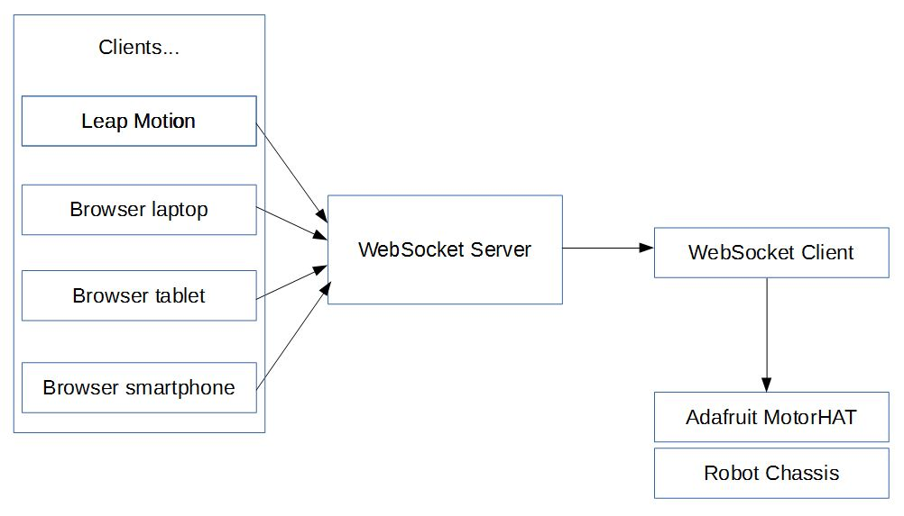

## Some "real" samples involving the components of the other projects
---
#### Summary
- [Robot on wheels](#robotonwheels)
- and more... This doc is lagging behind.

---
- Languages comparison, [solving a system](./LanguageComparison.md).

---

### <a name="robotonwheels"></a>Robot on wheels

Uses jQuery and WebSockets.

Uses the Adafruit Motor Hat.

See the Java code [here](https://github.com/OlivierLD/raspberry-pi4j-samples/tree/develop/RasPISamples/src/robot/ws). The
`node.js` server code is in the `node` directory, see `robot.server.js`.

The Web interface main page is `robot.pilot.html`, served by `node.js` as well.

To proceed:
- start the `node.js` server, type in the `node` directory
```
prompt> node robot.server.js
```
- start the robot driver `robot.pilot`

#### Architecture


The [Adafruit Motor Hat](https://www.adafruit.com/products/2348) drives the servos, attached on the [Chassis](https://www.adafruit.com/product/2939).
The code for the Java Motor HAT is in the [I2C.SPI project, package i2c.servo.adafruitmotorhat](https://github.com/OlivierLD/raspberry-pi4j-samples/tree/master/I2C.SPI/src/i2c/servo/adafruitmotorhat).

_Note_: The Leap Motion client is mentioned as an example. Its implementation is not finished yet.

The WebSocket server is a `NodeJS` server, with the `websocket` module installed on it.
```
 prompt> cd node
 prompt> npm install websocket
```
Again, to start it:
```
 prompt> node robot.server.js
```
The `node` server is also an HTTP server, that serves the web pages used by the clients at the left of the diagram.

The `node` server can run on the Raspberry PI , or on another machine (in which case the `ws.uri` System variable in the Java code must be tweaked to point to it).

The actions (buttons pushed and released, etc) on the user interface (browser) are translated into `JSON` objects sent to the
WebSocket server. When receiving a message, the server re-broadcasts it to the connected client(s).
They are then received by the `WebSocket client` that talks to the MotorHAT driver accordingly.

The `JSON` message look like this
```
{
  "command": "forward",
  "speed": 128
}
```
See the code for details.

### Pitch and roll
Read an LSM303 I2C board to get the pitch and roll. Feeds a WebSocket server with the data.
An HTML page displays a boat, graphically, with the appropriate picth and roll.

Run
```bash
 $> ../gradlew clean shadowJar
```
Then, from one shell
```bash
 $> cd node
 $> node server.js
```
And from another one
```bash
 $> ./pitchroll

```
Then from a browser, reach the machine where `node` is running:
```
 http://<machine-name>:9876/data/pitchroll.html
```


