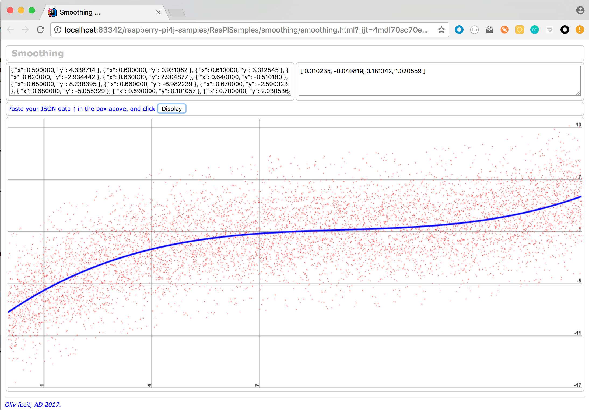

## Smoothing, rendering.
The class in this package `raspisamples.smoothing.LeastSquares.java` is using the Least Squares method to find the coefficients of a polynomial, so the difference between
the point of the curve (at a given abscise) and the points of the cloud is as small as possible.

There is a Scala equivalent of this class, in `smoothing.LeastSquares.scala`.

For details on this method, see [here](http://www.efunda.com/math/leastsquares/leastsquares.cfm) and [here](http://www.lediouris.net/original/sailing/PolarCO2/index.html).

There is a web page to visualize the smoothing at work.

To make it work:

* See in the `main` method the way the `cloudGenerator` method is invoked.

```java
	if (false) { // Turn to true to re-generate data
		BufferedWriter bw = new BufferedWriter(new FileWriter("cloud.csv"));
		cloudGenerator(bw, 0, 50, 0.01, 5, 1, -0.0061, 0.0029, 4.6);
		bw.close();
	}

	if (true) {
		csvToJson("cloud.csv", "cloud.json");
	}
```

The `cloudGenerator` is invoked as follow:
```java
cloudGenerator(bw, 0, 50, 0.01, 5, 1, -0.0061, 0.0029, 4.6);
```
That means:

* generate a cloud of point
* from abscise 0
* to abscise 50
* with a step of 0.01
* with a tolerance of 5 (in y)
* iterate 1 time
* used the polynomail coefficients [-0.0061, 0.0029, 4.6].

The data are generated in a file named `cloud.csv`, it can be opened as a spreadsheet.
Turn the boolen to `true` for this to happen...

The method `csvToJson` can turn those data into a `json` object.

Now run the class
```bash
$> java -cp build/libs/RasPISamples-1.0-all.jar raspisamples.smoothing.LeastSquares
...

-0.006028
0.001358
4.481926

Deg 2 -> -0.006028
Deg 1 -> 0.001358
Deg 0 -> 4.481926
$>
```

See the calculated coefficients (you required a degree 2 for the polynomial), put them in a `json` array:
```json
[ -0.006028, 0.001358, 4.481926 ]
```
Now, load the web page (available in this project) `smoothing/smoothing.html` in your browser,
paste the content of `cloud.json` in the box on the top left, paste the coefficient array in the box on the right,
and click the `Display` button:


---
