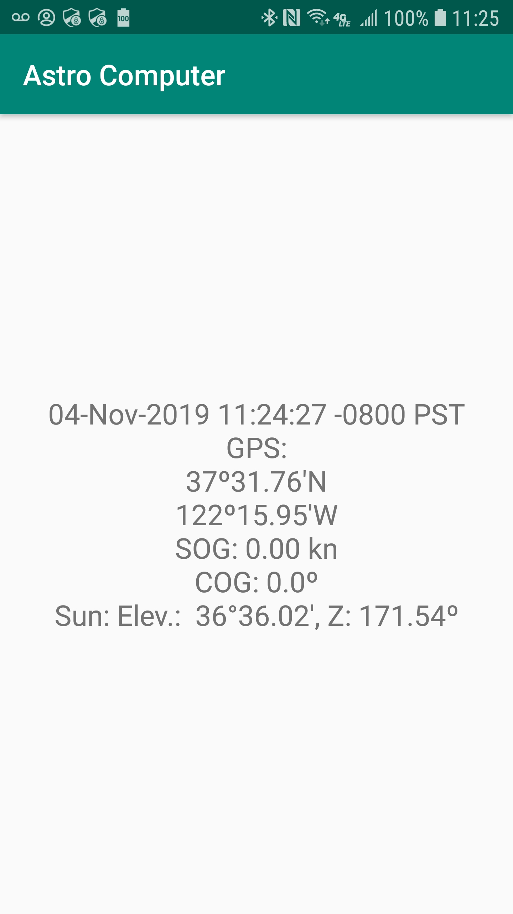

## Android, Android Things, etc, WIP
Android (Android Things) can run on the Raspberry pi.
This section is about giving it a try...

- [Install Android Thing on Raspberry Pi](https://developer.android.com/things/hardware/raspberrypi)
- [Install Android Studio](https://developer.android.com/studio/install)

---
### Projects
- [`AstroComputer`](./AstroComputer), a phone or tablet app, displaying current time, current position, and Sun coordinates (Elevation and azimuth)

---
