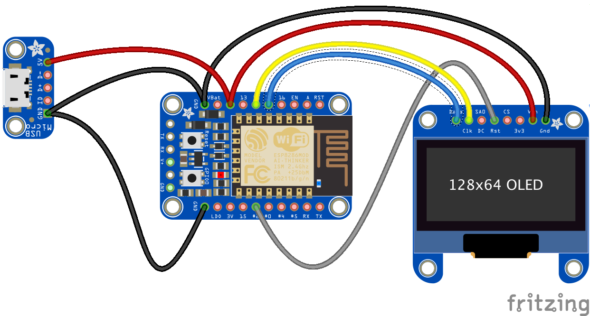

### TCP Smart Watch
The idea is to have a watch-like device that does _not_ need a smart phone to connect to a network.

It will be using REST over HTTP, TCP will come later.

The ESP8266/Huzzah has built-in WiFi capabilities, and can deal with an OLED screen like the `SSD1306`.

The starting point was [this document](https://learn.adafruit.com/huzzah-weather-display?view=all).

The ESP8266 will ping the [NavServer/NMEA.multiplexer](https://github.com/OlivierLD/raspberry-coffee/blob/master/NMEA.multiplexer/README.md) with a request like `GET /mux/cache?option=txt`.

---
