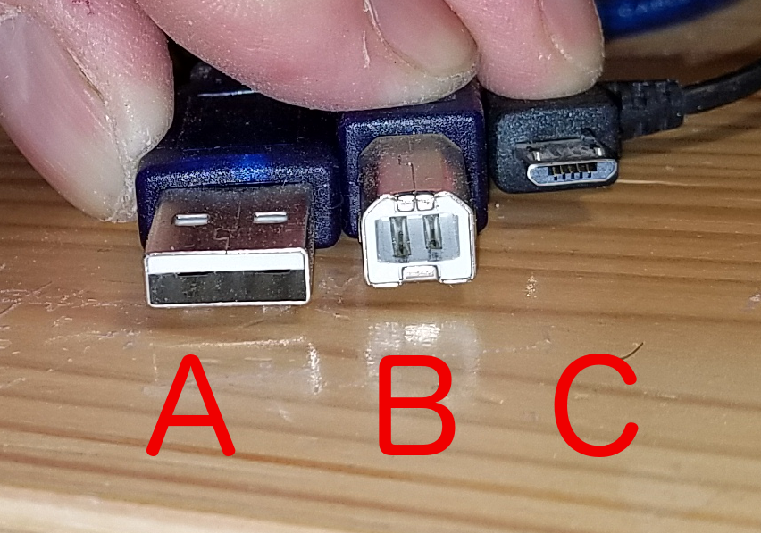
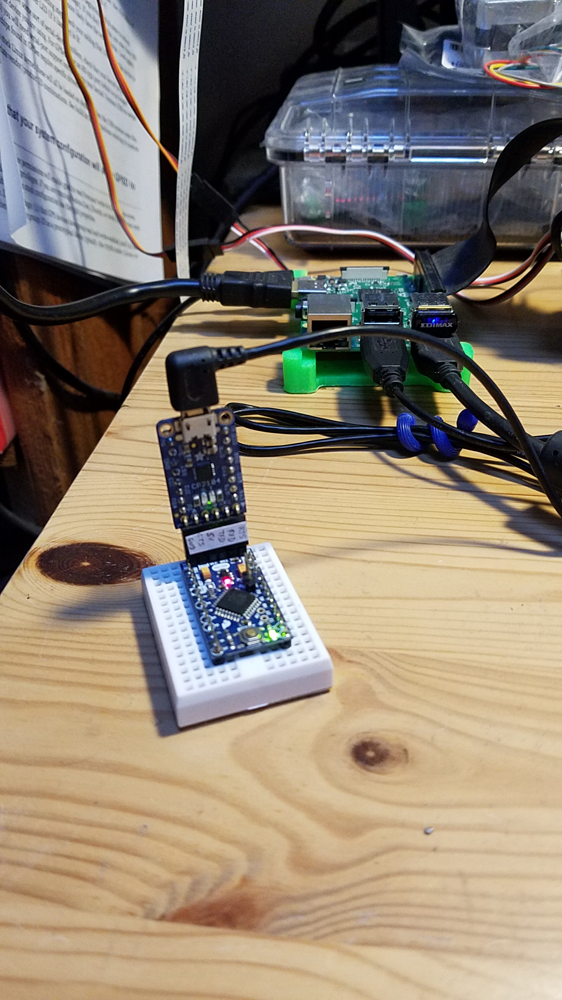
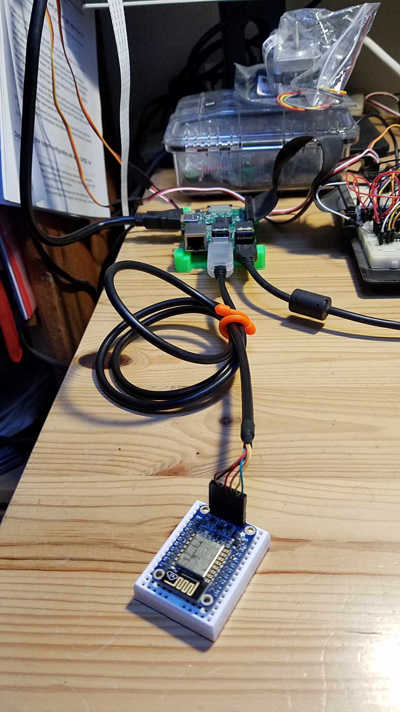
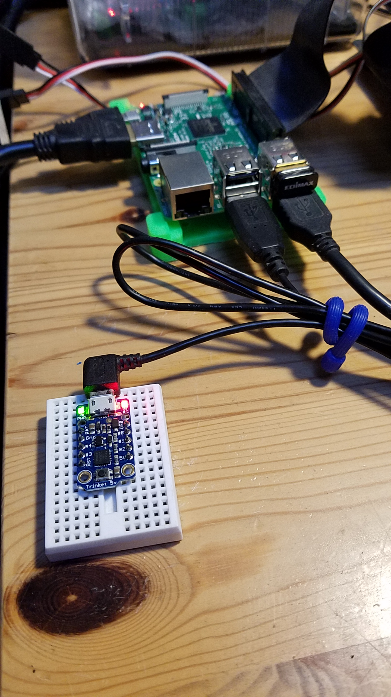

## Small Boards
This is not Java-related, but Java on the Raspberry PI can communicate with those guys.
Several possibilities are available, among them:
- Serial
- I2C
    - About I2C, see how to use those small boards as I<sup><small>2</small></sup>C slaves [here](https://github.com/OlivierLD/raspberry-pi4j-samples/blob/master/I2C.SPI/src/i2c/comm/README.md).

#### Arduino Uno, Arduino Mini, ESP8266 (Huzzah), Adafruit Trinket, Photon, etc

###### Universal Serial Bus (USB)
_Universal_, but there are at least 3 versions: A, B, C:



## Install the Arduino IDE on the Raspberry PI
- Go to [arduino.cc](https://www.arduino.cc/) -> Software
- Download the last version for Linux ARM

Then

```bash
 $ cd ~/Downloads
 $ tar -xvf arduino-1.8.5-linuxarm.tar.xz
 $ sudo mv arduino-1.8.5 /opt
 $ cd /opt/arduino-1.8.5
 $ ./install.sh
```

### Arduino Uno
Use a USB-A to USB-B (male-male) cable.

For Arduino Uno, use board `Arduino/Genuino Uno`.


Programmer: `AVRISP mkII`

### Arduino Mini
Use a [CP2104](https://www.adafruit.com/product/3309) connector and a USB-A to USB-C (male-male) cable.



Programmer: `AVRISP mkII`

For Arduino Pro Mini, use board `Arduino Pro or Pro Mini`, Processor `ATmega328P (3.3V, 8MHz)`, even for 5 volts version.

### ESP8266 (Adafruit Huzzah)
Programmer: `AVRISP mkII`.

In the Arduino IDE, got to `File > Preferences`, and add a URL in `Boards Manager URLS`:
```
 http://arduino.esp8266.com/stable/package_esp8266com_index.json
```
Connect the Huzzah to the Raspberry PI with an [FTDI cable](https://www.adafruit.com/product/70), make sure the black goes on the `GND`.



To upload a sketch:
- press the `GPIO0` button
- press the `Reset` button
- release the `Reset` button
- release the `GPIO0` button

The red led should be dimmed, the board is ready to receive the sketch, you can upload it from the IDE.


### Adafruit 5v Trinket
Programmer: `USBtinyISP`.

In the Arduino IDE, got to `File > Preferences`, and add a URL in `Boards Manager URLS`:
```
 https://adafruit.github.io/arduino-board-index/package_adafruit_index.json
```
Use a USB-A to USB-C (male-male) cable.



To upload a sketch:
- Press the button on the Trinket - verify you see the red LED pulse. This means it is ready to receive data.

See the [Adafruit tutorial](https://learn.adafruit.com/introducing-trinket?view=all).

### Photon
Use a USB-A to USB-C (male-male) cable.

Beside that, the `Photon` uses its own web-based IDE, at [https://build.particle.io](https://build.particle.io)'.
The code is similar to what's used above. It also comes with a free access to an IoT server.
