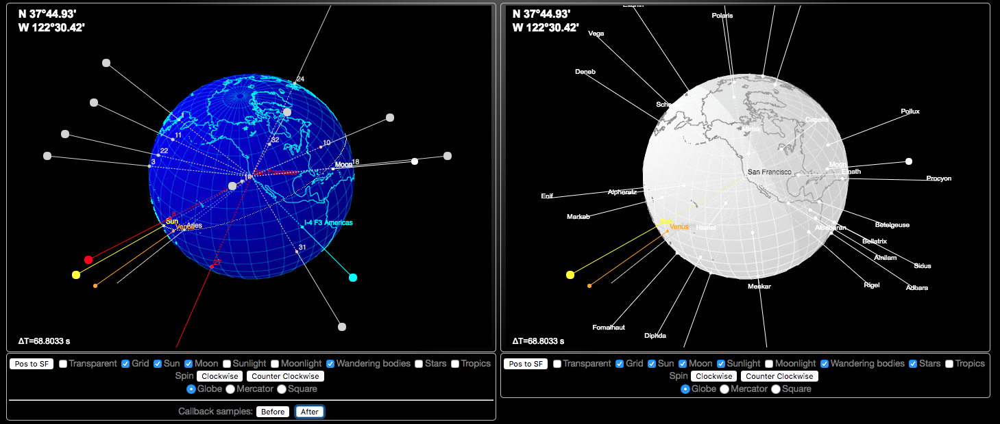
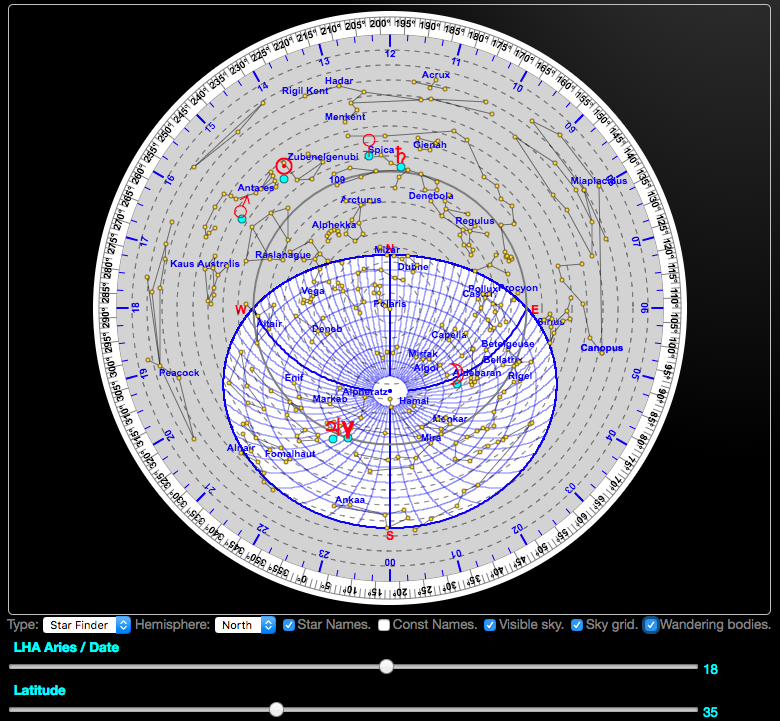
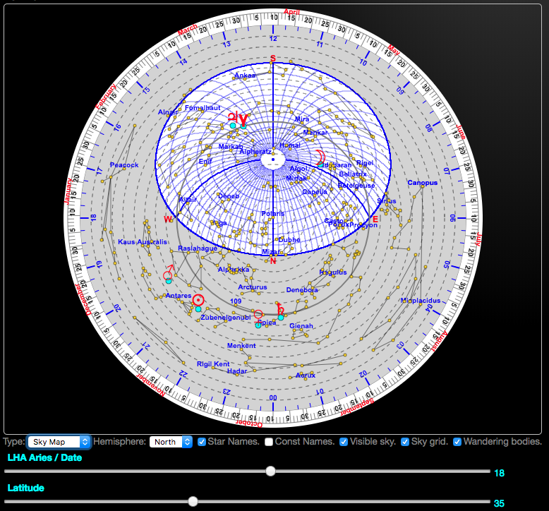

## Oliv's Web Components

> Note: _Those components requires **absolutely NO** external library._

> Some components might require some provided utilities like
> - `character.matrixes/characters.js`
> - `stars/constellation.js`
> - `utilities/Utilities.js`

They do require a WebComponents-savvy browser though. Most of them are (or will shortly be...).

### Live Demos
Requires `nodejs` to be available on your system.

To see the components at work, after cloning the repo, start the `node` server _**from the `WebComponents` directory**_, and load `index.html` in a browser:

```bash
 $> node server.js
```
Then load [http://localhost:8080/oliv-components/index.html](http://localhost:8080/oliv-components/index.html) in a WebComponents-enabled web browser.

#### Also available
After starting the `node` server as mentioned above, you can also reach
- [http://localhost:8080/oliv-components/mirror.html](http://localhost:8080/oliv-components/mirror.html), the basis for an Heads Up display application.
- [http://localhost:8080/oliv-components/pwm.html](http://localhost:8080/oliv-components/pwm.html), for an explanation about how Pulse Width Modulation works.


### Components list
- Pluviometer. &#9989; Done.
- Thermometer. &#9989; Done
- Jumbo Display. &#9989; Done
- Direction Display. &#9989; Done
- Analog Display. &#9989; Done
- Wind Angle. &#9989; Done
- Globe and Map (with `import` and `module`). &#9989; Done <!-- &#10140; WIP -->
- Compass Rose. &#9989; Done
- Digital Display. TODO
- Date (calendar) display. &#9989; Done
- Watch/Clock (analog). &#9989; Done
- Marquee. &#9989; Done
- Evolution Displays. TODO
- Generic Graphs. TODO
- Sky Map and Star Finder (along with some `REST` service(s)). &#9989; Done

#### Screenshots, as they appear from the Demo page
World Map it is `globe` configuration:



SkyMap in its `Star Finder` configuration:



SkyMap in its `Sky Map` configuration:



#### Maybe next?
- Satellite plotter? &#10140; See the `doAfter` callback on the Globe examples.
- Tide Graph?
- Current Display?
- Boat Overview?

---

##### Artifacts
- Javascript Modules (careful with Firefox 58 and below...)
    - defining the component's parameters (properties) and behavior
- Examples, in `index.html` and on [`CodePen`](http://codepen.io/OlivierLD/).
    - including animations examples
- CSS rules and classes (in their own stylesheet, `web-components.css`)

---

#### TODO
- JSDoc
- Local `npm` registry? ... to avoid having to copy code across modules.

#### CodePen (might not be 100% in sync... But close'ish)
The point of truth remains this repo.

Components above, live at [CodePen](http://codepen.io/OlivierLD/), when released.

- [Jumbo Display](https://codepen.io/OlivierLD/pen/VQyVjy).
- [Pluviometer](https://codepen.io/OlivierLD/pen/oEPKgg).
- [Thermometer](https://codepen.io/OlivierLD/pen/KQQEEp).
- [Direction](https://codepen.io/OlivierLD/pen/bLjwdj).
- [Analog Display](https://codepen.io/OlivierLD/pen/QQBYEw).
- [Compass Rose](https://codepen.io/OlivierLD/pen/aqaLQq).
- [World Map](https://codepen.io/OlivierLD/pen/xYQbmb).
- [Calendar Display](https://codepen.io/OlivierLD/pen/EpOJEW).
- [SkyMap/StarFinder](https://codepen.io/OlivierLD/project/full/APNqRk).

#### Firefox 58
If you are having trouble running the WebComponents in Firefox 58, see
[this document](https://www.designedbyaturtle.co.uk/2015/how-to-enable-web-components-in-firefox-shadow-dom/).

#### Transpilation - Warning: could not get it to work correctly.
Use `babel`, as explained [here](https://babeljs.io/docs/usage/cli/).

```bash
 $ npm install --save-dev babel-cli babel-preset-env
```
Create a `.babelrc`
```bash
 $ echo '{ "presets": ["env"] }' > .babelrc
```
And run the transpilation:
```bash
 $ npx babel oliv-components/widgets --out-dir oliv-components/lib
```
The `lib` directory now contains the transpiled files.

---
&copy; 2018, by Oliv Soft.

