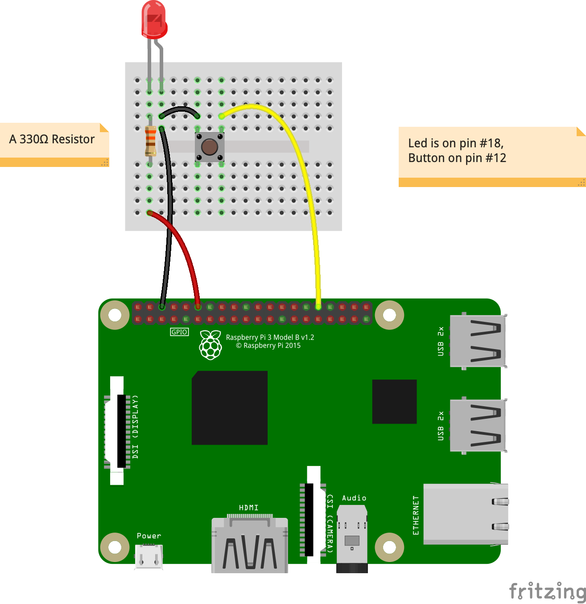
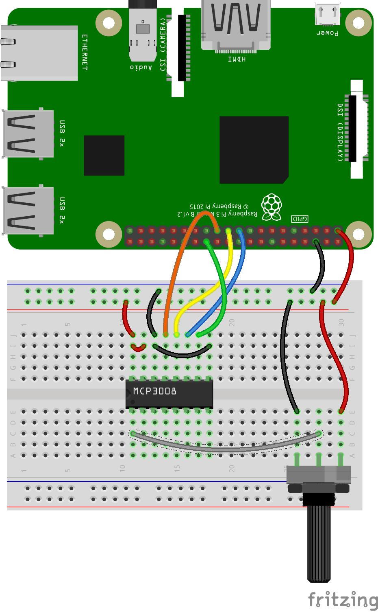

# [DIOZERO](https://www.diozero.com/)

Another option than `PI4J`. Let's give it a try.  
Seems not to require any external system library. Interesting.

> _Note_: Running on Linux _stretch_, I had a `/lib/arm-linux-gnueabihf/libc.so.6: version 'GLIBC_2.28' not found` when using diozero.    
> Upgrade to _bullseye_, as explained [here](https://www.sanderh.dev/upgrade-Raspberry-Pi-bullseye/).

- diozero [git repo](https://github.com/mattjlewis/diozero)
- Samples: <https://github.com/mattjlewis/diozero/tree/main/diozero-core/src/main/java/com/diozero/devices>

> We also want to make sure this work on other JVM Languages too.  
> Install `sdkman`: `curl -s get.sdkman.io | bash`  
> `$ source ~/.sdkman/bin/sdkman-init.sh`
- Scala (install [Scala](https://sdkman.io/sdks#scala))
- Kotlin (install [Kotlin](https://sdkman.io/sdks#kotlin))
- Groovy (install [groovy](https://sdkman.io/sdks#groovy), or [here](https://groovy-lang.org/install.html))
  - Install a given version: `sdk install groovy 3.0.10` 

Build this first sample, from the `diozero-101` folder, do a: 
```
$ ../gradlew shadowJar
```
Then, for Java:
```
$ java -jar build/libs/diozero-101-1.0-all.jar
$ java -cp build/libs/diozero-101-1.0-all.jar diozerotests.SystemInformation
```
For Kotlin:
```
$ kotlin -cp build/libs/diozero-101-1.0-all.jar diozerokt.FirstTestKt        # Kt added because it is a script.
$ kotlin -cp build/libs/diozero-101-1.0-all.jar diozerokt.SystemInformation 
```
For Scala:
```
$ scala -cp build/libs/diozero-101-1.0-all.jar DioZero
```
For Groovy, use `groovyConsole`, and add the `diozero-101-1.0-all.jar` to the classpath (Menu `Script` > `Add Jar(s) to ClassPath`), or
```
$ groovy -cp build/libs/diozero-101-1.0-all.jar src/main/groovy/DioZeroGroovy.groovy 
```
To run the above, make sure the `groovy` runtime version matches the one in `build.gradle`.

---

### Wiring (for tests 1 to 3)
The LED requires a resistor (330 &Omega; will do).  
Many on-line (or not) resistor color-code applications are available:
- <https://www.calculator.net/resistor-calculator.html>
- <https://www.allaboutcircuits.com/tools/resistor-color-code-calculator/>
- <https://www.digikey.fr/en/resources/conversion-calculators/conversion-calculator-resistor-color-code>
- etc...

Connecting leds: See [this](https://makecode.adafruit.com/learnsystem/pins-tutorial/devices/led-connections).



### Wiring for MCP3008
> _Note_: Not found the way to change the wiring for SPI, as it can be done with PI4J...  

On the diagram below,
- The `MCP3008`'s `CLK` (`#13`) is connected on the RPi's `SCLK` (`BCM 11`, `Physical #23`) - Orange wire
- The `MCP3008`'s `Dout` (`#12`) aka `MISO`, is connected on the RPi's `MISO` (`BCM 9`, `Physical #21`) - Yellow wire
- The `MCP3008`'s `Din` (`#11`) aka `MOSI`, is connected on the RPi's `MOSI` (`BCM 10`, `Physical #19`) - Blue wire
- The `MCP3008`'s `CS` (`#10`) is connected on the RPi's `CE1` (`BCM 7`, `Physical #26`) - Green wire



#### Note about MCP3008
> The above works fine on a Raspberry Pi 3B, but at some point, I had trouble getting it to work on the 4B.
> 
> I finally got it to work (in RasPi OS 32 bits _**and**_ 64 bits) on a brand new bullseye OS (full install), on both CE1 and CE0.  
> But as soon as `wiringPi` was put to work, `diozero` stopped working as expected. Interestingly, a reboot fixes the situation.  
> This might be something to keep in mind, if you want to work with _both_ `PI4J/wiringPi` and `diozero`.  
> And `wiringPi` seems not to be suited for a 64-bit OS...


- PI4J : <https://github.com/OlivierLD/raspberry-coffee/tree/master/raspberry-io-pi4j/ADC>
- JOB (WiP, a test) : <https://github.com/OlivierLD/JOB>, use the script `samplemenu.sh` in the `core` folder.

---
