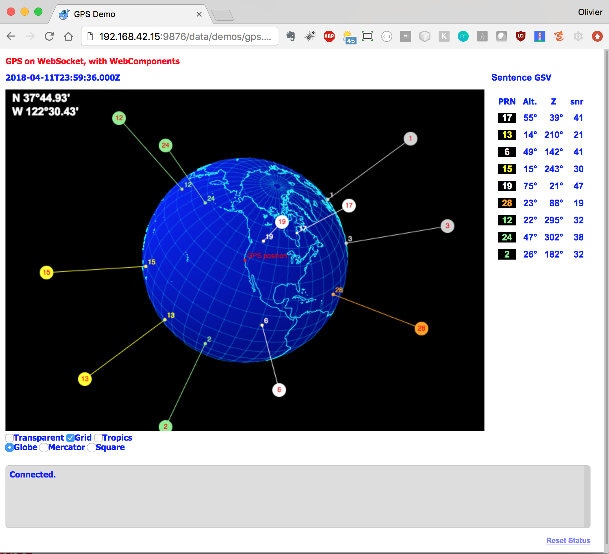

# Docker
This folder is not a module of the project. It can be used in standalone.


Good article [here](https://howchoo.com/g/nmrlzmq1ymn/how-to-install-docker-on-your-raspberry-pi).

- First, [get Docker](https://store.docker.com/search?type=edition&offering=community) on your system.
- For a Raspberry Pi, also see [here](https://medium.com/free-code-camp/the-easy-way-to-set-up-docker-on-a-raspberry-pi-7d24ced073ef),
and [here](https://phoenixnap.com/kb/docker-on-raspberry-pi).

#### To get started...
After installing Docker, try this:
```
 $ docker run hello-world
 $ docker run docker/whalesay cowsay Hello there!
```

#### Pre-defined Docker images
This project also provides a script that will build pre-defined Docker images (different OS's, with various features).
Look into the script, the images are defined by the files `*.Dockerfile`.

Just run `image.builder.sh`:
```
 $ ./image.builder.sh
+-------------- D O C K E R   I M A G E   B U I L D E R ---------------+
+------------------- Build and run a docker image. --------------------+
|  1. Nav Server, Debian                                               |
| 1p. Nav Server, Debian, with proxy                                   |
|  2. Web Components, Debian                                           |
|  3. To run on a Raspberry Pi, Java, Raspberry Coffee, Web Components |
|  4. Node PI, to run on a Raspberry Pi                                |
|  5. Node PI, to run on Debian                                        |
|  6. GPS-mux, to run on a Raspberry Pi (logger)                       |
|  7. Golang, basics                                                   |
|  8. Raspberry Pi, MATE, with java, node, web comps, VNC              |
|  9. Debian, Java, Scala, Spark                                       |
| 10. Ubuntu MATE, TensorFlow, Python3, VNC                            |
+----------------------------------------------------------------------+
| Q. Oops, nothing, thanks, let me out.                                |
+----------------------------------------------------------------------+
== You choose =>
```
This script takes care of building different `docker` images. `docker` commands can be pretty lengthy..., the script takes care of everything.
Look into the script for details.

#### Let's go

`docker`'s commands are described [here](https://docs.docker.com/engine/reference/commandline/docker/).

Using `image.builder.sh`, choose option `1`, it takes some time, the server is started by `docker`,
and you can log on to the image if you want (it's not necessary):
```bash
$ docker run -it oliv-nav:latest /bin/bash
#     #
##    #    ##    #    #
# #   #   #  #   #    #
#  #  #  #    #  #    #
#   # #  ######  #    #
#    ##  #    #   #  #
#     #  #    #    ##

 #####
#     #  ######  #####   #    #  ######  #####
#        #       #    #  #    #  #       #    #
 #####   #####   #    #  #    #  #####   #    #
      #  #       #####   #    #  #       #####
#     #  #       #   #    #  #   #       #   #
 #####   ######  #    #    ##    ######  #    #

git version 2.11.0
node:v9.11.2
npm:5.6.0
openjdk version "1.8.0_171"
OpenJDK Runtime Environment (build 1.8.0_171-8u171-b11-1~deb9u1-b11)
OpenJDK 64-Bit Server VM (build 25.171-b11, mixed mode)
root@1d4ff153852b:/workdir/raspberry-coffee/RESTNavServer#
```

From the host (where the `docker` command was fired), reach for example <http://localhost:8080/oplist>
```
[{
"verb": "GET",
"path": "/oplist",
"description": "List of all available operations, on all request managers.",
"fn": {}
},
{
"verb": "GET",
"path": "/ww/composite-hierarchy",
"description": "Retrieve the list of the composites already available on the file system",
"fn": {}
},
{
"verb": "GET",
"path": "/astro/oplist",
"description": "List of all available operations, on astro request manager.",
"fn": {}
},
{
"verb": "GET",
"path": "/astro/positions-in-the-sky",
"description": "Get the Sun's and Moon's position (D & GHA) for an UTC date passed as QS prm named 'at', in DURATION Format. Optional: 'fromL' and 'fromG', 'wandering' (true|[false]).",
"fn": {}
},
{
"verb": "POST",
"path": "/astro/sun-now",
"description": "Create a request for Sun data now. Requires body payload (GeoPoint)",
"fn": {}
 ...
```
Yeah!

You can also reach [http://localhost:8080/web/index.html](http://localhost:8080/web/index.html) from a browser.

From another shell:
```bash
$ docker ps
CONTAINER ID        IMAGE               COMMAND                  CREATED             STATUS                      PORTS               NAMES
a335f585deb0        oliv-image          "/bin/bash"              36 minutes ago      Exited (0) 35 minutes ago                       confident_proskuriakova
f36550370ea8        445821efd8a0        "/bin/sh -c 'echo “g…"   44 minutes ago      Exited (2) 44 minutes ago                       affectionate_davinci
```


Get the CONTAINER ID like `a335f585deb0`
```bash
$ docker stop a335f585deb0
```

To drop the image:
```bash
$ docker rmi oliv-image
```

The scripts `rm.container.sh` and `rm.images.sh` are here to help...

### Examples

```bash
$ docker build -f webcomponents.Dockerfile -t oliv-image .
$ docker run -p 8081:8080 -it oliv-image /bin/bash
root@7e754f8732a0:/workdir/WebComponents# node server.js
```

Then reach `http://localhost:8081/oliv-components/index.html`

etc, etc...

### Case Study
You have a `nodejs` project you want to share with others.

The application reads GPS data through a Serial port, and feeds a `WebSocket` server.
The data can then be visualized through a Web interface using Web Component(s).

To enable everything, you need to:
1. Have a Raspberry Pi
1. Flash its SD card and connect it to a network
1. Install build tools
1. Install `git`
1. Install `Node.js` and `npm`
1. Clone the right `git` repository
1. Install *_all_* the required `node` modules
1. Drill down into the right directory
1. Start the `node` server with the right script
1. Access the Raspberry Pi from another machine on the same network, and reach the right HTML page.

This is certainly not difficult, but there are many ways to do several mistakes at each step
of the process.

`Docker` can take care of the steps `3` to `9`.
It will build the image, and then run it.
The image can also be pushed to a repository, so users would not have to build it.
Just to run it after downloading it.

The only pre-requisite would be to have installed `Docker` on the machine (the Raspberry Pi here),
as explained at the top of this document.

In this case, the full `Docker` image creation (named `oliv-nodepi` below) comes down to:
```bash
 $ docker build -f node-pi.Dockerfile -t oliv-nodepi .
Sending build context to Docker daemon  752.6kB
Step 1/20 : FROM resin/raspberrypi3-debian:latest
 ---> c542b8f7a388
Step 2/20 : MAINTAINER Olivier LeDiouris <olivier@lediouris.net>
 ---> Using cache
 ---> b2ff0d7c489f
Step 3/20 : ADD nodepi.banner.sh /
 ---> 535733298dd1
Step 4/20 : RUN echo "alias ll='ls -lisah'" >> $HOME/.bashrc
 ---> Running in 09baf7261a55
Removing intermediate container 09baf7261a55
 ---> 71e1e4c95663
Step 5/20 : RUN apt-get update
 ---> Running in 5d817a941a14
Get:1 http://security.debian.org jessie/updates InRelease [94.4 kB]
Get:2 http://archive.raspbian.org jessie InRelease [14.9 kB]
Get:3 http://archive.raspberrypi.org jessie InRelease [22.9 kB]

...

npm notice created a lockfile as package-lock.json. You should commit this file.
added 166 packages in 81.166s
Removing intermediate container 13986530db28
 ---> 051eb94b8a3c
Step 19/20 : EXPOSE 9876
 ---> Running in 67b587845fe0
Removing intermediate container 67b587845fe0
 ---> 46973b7ba9ac
Step 20/20 : CMD ["npm", "start"]
 ---> Running in 153bf2ea02ad
Removing intermediate container 153bf2ea02ad
 ---> 6bf3d76d38ae
Successfully built 6bf3d76d38ae
Successfully tagged oliv-nodepi:latest
ed9a7d9042dddd3939b1788cf0e89d16f5273192a6456266507f072f90ce91bc
 $
```
Once the step above is completed, plug in your GPS, and run
```bash
 $ docker run -p 9876:9876 -t -i --privileged -v /dev/ttyUSB0:/dev/ttyUSB0 -d oliv-nodepi:latest
```
Then from a machine seeing the Raspberry Pi on its network (it can be the Raspberry Pi itself),
reach [http://raspi:9876/data/demos/gps.demo.wc.html](http://raspi:9876/data/demos/gps.demo.wc.html) in a browser.



This shows you the position the GPS has computed, and the satellites in sight.

You can also login to the image:
```bash
 $ docker run -it oliv-nodepi:latest /bin/bash

#     #                                 ######    ###
##    #   ####   #####   ######         #     #    #
# #   #  #    #  #    #  #              #     #    #
#  #  #  #    #  #    #  #####   #####  ######     #
#   # #  #    #  #    #  #              #          #
#    ##  #    #  #    #  #              #          #
#     #   ####   #####   ######         #         ###

git version 2.1.4
node:v9.11.1
npm:5.6.0
root@b9679d0d65a7:/workdir/node.pi#

```
... and do whatever you like.

The build operation needs to be done once. There is no need to do it again as long as no
change in the image is required.

### Stuff...

```bash
 $ CID=`docker run -d oliv-go:latest`
 $ docker logs $CID
 Hello go world!
 $
```

##### Save, and re-use
Let's say you run a container, you make modifications to the hosted system, you exit, but you want to later on reconnect and find the modifications you did before.

You run a new container:
```
Terminal-1$ docker run --interactive --tty --rm --publish 5901:5901 --publish 8888:8888 --env USER=root --volume tensorflow:/root/workdir/shared oliv-tf-vnc:latest /bin/bash
git version 2.1.4
node:v9.11.1
npm:5.6.0
root@b9679d0d65a7:/workdir/docker#
```
And you make your modifications.

Still connected to the container above (you've not exited), _from another terminal_:
```
Terminal-2$ docker export --output myarchive.tar [CONTAINER-ID]
```
Then you can exit your docker session above.
```
root@b9679d0d65a7:/workdir/docker# exit
```

To restore your container:
```
Terminal-X$ docker import myarchive.tar restored:new
```

This creates a new docker image, named `restored`, with the label `new`. Then you
```
Terminal-X$ docker run -it --rm -p 5901:5901 -p 8888:8888 -e USER=root -v tensorflow:/root/workdir/shared restored:new /bin/bash
```

The docker image you're now on reflects the changes done before the container was exported.

##### If `Docker.raw` becomes too big...
```
 $ docker system prune
```

### Docker Registry
At <https://hub.docker.com/>

#### To push an image to Docker Hub
- `docker tag de1ddc31533e olivierlediouris/navserver:latest` (`de1ddc31533e` is the image-id, returned by `docker images`)
- `docker login --username olivierlediouris --password xxxxxx`
- `docker push olivierlediouris/navserver:latest`
 
The local image can then be removed, and it can now be run like
- `docker run olivierlediouris/navserver`

-------------------------------
