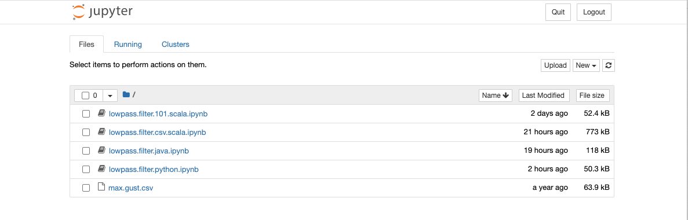
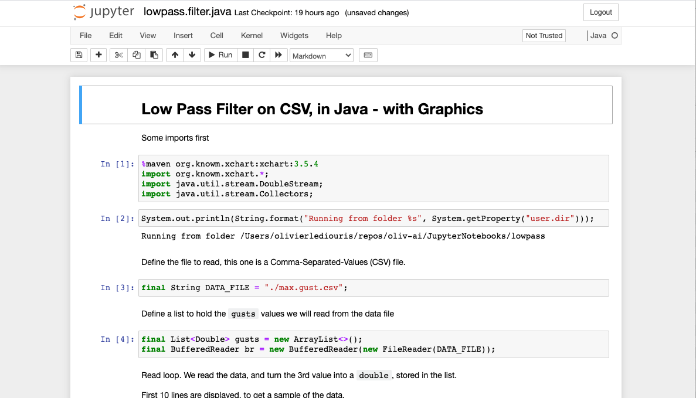

## Notes about Spark-Debian, Jupyter Notebooks

- You have built the image option "9", with the Dockerfile `spark-debian.Dockerfile`:
  ```
  $ ./image.builder.sh 
  +-------------- D O C K E R   I M A G E   B U I L D E R ---------------+
  +----------------- Build 🏗️  and run 🏃 a docker image. ----------------+
  |  1. Nav Server, OpenJDK on Debian                                    |
  | 1p. Nav Server, Debian, through a proxy (as an example)              |
  |  2. Web Components, Debian                                           |
  |  3. To run on a Raspberry Pi, Java, Raspberry Coffee, Web Components |
  | 3m. Raspberry Pi minimal config (a base for the future)              |
  |  4. Node PI, to run on a Raspberry Pi                                |
  |  5. Node PI, to run on Debian                                        |
  |  6. GPS-mux, to run on a Raspberry Pi (logger)                       |
  |  7. Golang, basics                                                   |
  |  8. Raspberry Pi Desktop, MATE, with java, node, web comps, VNC,     |
  |                                                inkscape, gtk samples |
  |  9. Debian 10, Java, Scala, Spark, Jupyter Notebook                  |
  | 10. Debian 10, TensorFlow, Keras, Python3, Jupyter, PyCharm,         |
  |                                                 VNC, nodejs, npm,... |
  | 11. Debian dev env, git, java, maven, node, npm, yarn, VNC...        |
  | 12. nav-server, prod (small) to run on a Raspberry Pi (WIP)          |
  +----------------------------------------------------------------------+
  | Q. Oops, nothing, thanks, let me out.                                |
  +----------------------------------------------------------------------+
  == You choose => 9
  ```
- We want to send some files to this image, say the zip `lowpass.zip`.
    - Start the image from your host machine:
    ```
    $ docker run -it --rm -e USER=root -p 8080:8080 oliv-spark:latest /bin/bash
     #####
    #     #  #####     ##    #####   #    #
    #        #    #   #  #   #    #  #   #
     #####   #    #  #    #  #    #  ####
          #  #####   ######  #####   #  #
    #     #  #       #    #  #   #   #   #
     #####   #       #    #  #    #  #    #
    
    git version 2.20.1
    openjdk version "11.0.8" 2020-07-14
    OpenJDK Runtime Environment (build 11.0.8+10-post-Debian-1deb10u1)
    OpenJDK 64-Bit Server VM (build 11.0.8+10-post-Debian-1deb10u1, mixed mode, sharing)
    Scala code runner version 2.13.3 -- Copyright 2002-2020, LAMP/EPFL and Lightbend, Inc.
    -------------------------
    From /workdir, cd spark-3.0.1-bin-hadoop2.7-hive1.2
    Then ./bin/spark-shell
    as well as ./bin/pyspark
    or ./bin/run-example org.apache.spark.examples.SparkPi
    -------------------------
    To start Jupyter Notebooks:
    jupyter notebook --ip=0.0.0.0 --port=8080 --allow-root --no-browser
    -------------------------
    root@f4dd25018353:/workdir# 
    ```  
    - From another terminal, from the directory where `lowpass.zip` is,
    do a `docker ps`
    ```
    $ docker ps
    CONTAINER ID        IMAGE               COMMAND             CREATED              STATUS              PORTS                    NAMES
    f4dd25018353        oliv-spark:latest   "/bin/bash"         About a minute ago   Up About a minute   0.0.0.0:8080->8080/tcp   gracious_dijkstra
    ```
    - Note the `CONTAINER ID`, then send the zip to it:
    ```
    $ docker cp lowpass.zip f4dd25018353:/workdir/lowpass.zip
    ```
    - Go back to the running container, you should see your new file:
    ```
    root@f4dd25018353:/workdir# ll
    total 1.3M
     656748 4.0K drwxr-xr-x  1 root root    4.0K Oct 11 19:10 .
    1581047 4.0K drwxr-xr-x  1 root root    4.0K Oct 11 19:10 ..
     786824 4.0K drwxr-xr-x  1 root root    4.0K Oct 11 04:38 IJava
    1581088 1.3M -rw-r--r--  1  501 dialout 1.3M Oct 11 18:54 lowpass.zip
     655388 4.0K drwxr-xr-x 13 1000    1000 4.0K Aug 28 08:56 spark-3.0.1-bin-hadoop2.7-hive1.2
    root@f4dd25018353:/workdir# 
    ```
    - Unzip it and drill down into the `lowpass` folder, start `jupyter notebook`, and see the URLs
    ```
    $ unzip lowpass.zip
     . . .
    $ cd lowpass
    $ jupyter notebook --ip=0.0.0.0 --port=8080 --allow-root --no-browser
    [I 19:12:50.779 NotebookApp] Writing notebook server cookie secret to /root/.local/share/jupyter/runtime/notebook_cookie_secret
    [I 19:12:50.977 NotebookApp] Serving notebooks from local directory: /workdir/lowpass
    [I 19:12:50.977 NotebookApp] Jupyter Notebook 6.1.4 is running at:
    [I 19:12:50.977 NotebookApp] http://f4dd25018353:8080/?token=a4b5aa863443ada6170fb82fdce8a5c141bc00a155beb306
    [I 19:12:50.977 NotebookApp]  or http://127.0.0.1:8080/?token=a4b5aa863443ada6170fb82fdce8a5c141bc00a155beb306
    [I 19:12:50.977 NotebookApp] Use Control-C to stop this server and shut down all kernels (twice to skip confirmation).
    [C 19:12:50.980 NotebookApp] 
        
        To access the notebook, open this file in a browser:
            file:///root/.local/share/jupyter/runtime/nbserver-62-open.html
        Or copy and paste one of these URLs:
            http://f4dd25018353:8080/?token=a4b5aa863443ada6170fb82fdce8a5c141bc00a155beb306
         or http://127.0.0.1:8080/?token=a4b5aa863443ada6170fb82fdce8a5c141bc00a155beb306
    ```
    - Then, from a browser running on your host, reach `http://localhost:8080/?token=a4b5aa863443ada6170fb82fdce8a5c141bc00a155beb306`
    - You're in!
    
    - Click `lowpass.filter.java.ipynb` (or any other)
    
    - Execute the cells (Shift + Return), play with it, it's all yours!

---
    