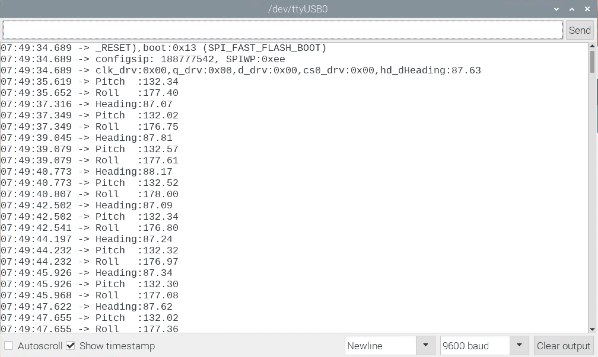

# HTTP Clients
### To get to sensor data

This comes from the following observation:

> Many breakout boards and sensors manufacturers provide - for their items -
> drivers very often written in Python.
> 
> Python is an OK scripting language, but has some limitations (ping me for details)...
> 
> This project the document you are reading is part of intends to provide drivers
> written in Java, so they can run on any Java Virtual Machine (JVM).
> 
> Compiled into Java byte code, such classes can be accessed by a variety of languages,
> also running on a JVM, like Java, Scala, Kotlin, Clojure, Groovy, JRuby...
> Find a list at <https://en.wikipedia.org/wiki/List_of_JVM_languages>.
>
> > This very interesting to see how the JVM gave birth to so many languages.
> > Implementing those languages comes down to implementing a compiler, that turns the
> > specific code _into JVM byte code_ (for that, see [ASM](https://asm.ow2.io/), for example). 
> > **Running** the code is the job of the JVM. 
> 
> Beside the elegance of their syntax and grammar, JVM-based languages come with the JVM features for free,
> like distributed implementation, inter-JVMs communication, remote debugging, and way more.
> 
> _But_ writing those drivers takes time, and sometimes too long...
> 
> The thing is that it is quite easy to expose the features of the manufacturer-provided-Python-drivers through
> protocols like HTTP and TCP (we will show how, look into `src/main/python-skeletons`). HTTP supports REST, that indeed
> became an industry standard.
> 
> And this is not only applicable to JVM-based languages, we will also show how to do this from NodeJS (through Node-RED).
> > Note: There is actually now a JVM implementation of NodeJS, see [GraalVM](https://www.graalvm.org/).
> 
> All this would fit perfectly in an Internet-Of-Things (IoT) environment. It can also be virtualized, with techniques like
> Docker and Kubernetes.
>
> _HTTP and its related technologies can be seen as what latin was in the medieval Europe:
> A mean of communication for people speaking different languages._

---

**We are showing here how to get data from HTTP servers reading breakout boards, 
using drivers written in a language we do not need to care about.**

---

Typically, this would concern drivers written in Python, see in the `Papirus` 
(look for `papirus_server.py`) and `I2C-SPI` (look for `lis3mdl_server.py`) modules.

As a proof-of-concept, we will showcase clients (http clients) written in a variety of languages, 
such as: 
- Java
- Scala (install [Scala](https://sdkman.io/sdks#scala))
- Kotlin (install [Kotlin](https://sdkman.io/sdks#kotlin))
- Groovy (install [groovy](https://sdkman.io/sdks#groovy), or [here](https://groovy-lang.org/install.html))
- [Processing](https://pi.processing.org/get-started/), Java 8 based.
- [Node-RED](https://nodered.org/docs/getting-started/), NodeJS based (JavaScript, ES6)
- Arduino (running - in this example - on an M5Stick-C)
- C - Make a simple HTTP Request ib C
- Python. A REST Client written for Python3, to close the loop.

> Note: To install extra languages, [SDKMAN](https://sdkman.io/install) is the easiest, whatever your system is.

### To run the samples

First, compile
```text
$ ../gradlew clean shadowJar
$ export CP=./build/libs/http-clients-1.0-all.jar
```

> Next, we need to have some http server running somewhere. Here we choose to 
> have one reading an **lis3mdl** board (magnetometer). This is just an example.
> That one happens to live in the `I2C-SPI` module, in this project (look for `lis3mdl_server.py`).

Then start the Python HTTP Server on a machine where it is available, along with the board it reads:
```text
$ cd I2C-SPI/src/main/python/lis3mdl
$ python3 lis3mdl_server.py --machine-name:$(hostname -I) --verbose:false
  Starting!
  Let's go. Hit Ctrl+C to stop
  Starting server on port 8080
  Try curl -X GET http://192.168.42.9:8080/lis3mdl/oplist
  or  curl -v -X VIEW http://192.168.42.9:8080/lis3mdl -H "Content-Length: 1" -d "1"
```

#### Java client
```text
$ java -cp ${CP} http.MagnetometerReader
Ctrl+C to stop
Heading: 143.892676 Pitch: 122.770906, Roll: -115.152288
Heading: 143.892676 Pitch: 122.770906, Roll: -115.152288
Heading: 143.892676 Pitch: 122.770906, Roll: -115.152288
Heading: 143.892676 Pitch: 122.770906, Roll: -115.152288
Heading: 143.892676 Pitch: 122.770906, Roll: -115.152288
Heading: 143.892676 Pitch: 122.770906, Roll: -115.152288
. . .
```

#### Scala client
```text
$ scala -cp ${CP} rest.LIS3MDLReader 
Ctrl+C to stop
Heading: 143.64324866174428 Pitch: 122.07185393670603, Roll: -114.76153087160264
Heading: 143.64324866174428 Pitch: 122.07185393670603, Roll: -114.76153087160264
Heading: 143.64324866174428 Pitch: 122.07185393670603, Roll: -114.76153087160264
Heading: 143.76748929250718 Pitch: 121.24913419262627, Roll: -113.97161468597878
Heading: 143.76748929250718 Pitch: 121.24913419262627, Roll: -113.97161468597878
Heading: 143.76748929250718 Pitch: 121.24913419262627, Roll: -113.97161468597878
Heading: 143.76748929250718 Pitch: 121.24913419262627, Roll: -113.97161468597878
. . .
```
> Note: you can also do a
```text
$ java -cp ${CP} rest.LIS3MDLReader 
. . .
```

#### Kotlin client
```text
$ kotlin -cp ${CP} restkt.KtMagReader
Heading:143.34438513662025 °, Pitch:122.7128245452906 °, Roll:-115.54712852747782 °
Heading:143.34438513662025 °, Pitch:122.7128245452906 °, Roll:-115.54712852747782 °
Heading:143.34438513662025 °, Pitch:122.7128245452906 °, Roll:-115.54712852747782 °
Heading:143.34438513662025 °, Pitch:122.7128245452906 °, Roll:-115.54712852747782 °
Heading:143.34438513662025 °, Pitch:122.7128245452906 °, Roll:-115.54712852747782 °
Heading:143.34438513662025 °, Pitch:122.7128245452906 °, Roll:-115.54712852747782 °
Heading:143.34438513662025 °, Pitch:122.7128245452906 °, Roll:-115.54712852747782 °
Heading:143.34438513662025 °, Pitch:122.7128245452906 °, Roll:-115.54712852747782 °
. . .
```
> Note: you can also do a 
```text
$ java -cp ${CP} restkt.KtMagReader
. . .
```

#### Groovy client
```text
$ groovy -cp ${CP} src/main/groovy/magreader.groovy 
WARNING: An illegal reflective access operation has occurred
WARNING: Illegal reflective access by org.codehaus.groovy.reflection.CachedClass$3$1 (file:/Users/olivierlediouris/.gradle/caches/modules-2/files-2.1/org.codehaus.groovy/groovy-all/2.4.6/478feadca929a946b2f1fb962bb2179264759821/groovy-all-2.4.6.jar) to method java.lang.Object.finalize()
WARNING: Please consider reporting this to the maintainers of org.codehaus.groovy.reflection.CachedClass$3$1
WARNING: Use --illegal-access=warn to enable warnings of further illegal reflective access operations
WARNING: All illegal access operations will be denied in a future release
Heading: 143.737568 Pitch: 123.377093, Roll: -115.793348
Heading: 143.737568 Pitch: 123.377093, Roll: -115.793348
Heading: 143.737568 Pitch: 123.377093, Roll: -115.793348
Heading: 143.737568 Pitch: 123.377093, Roll: -115.793348
Heading: 143.737568 Pitch: 123.377093, Roll: -115.793348
Heading: 143.737568 Pitch: 123.377093, Roll: -115.793348
. . .
```

#### Processing client
> Important Note: You must have compiled the required classes with Java 8, *not* Java 11!
> Prepare the jar with a 
```text
$ ../gradlew clean shadowJar -x test -x :http-clients:compileGroovy -x :http-clients:compileScala
```

- Open the sketch `ProcessingClient` in the Processing IDE
- Use the menu `Sketch` > `Add File...` to add `./build/libs/http-clients-1.0-all.jar` (compiled with Java 8). 
- Then you can run the sketch


#### Node-RED client
- Start Node-RED from a terminal
```text
$ node-red
```
The default port is `1880`.
- Open <http://localhost:1880/> in a browser.
- Copy the content of `node.json`, in `src/main/node-red`, into the clipboard.
- In Node-RED's Web Interface, use the hamburger at the top-right to `Import` the content of the clipboard.
- You might want to modify the address of the server in the `magdata` node.
- Then use the `Deploy` button
- You should see the data in the `Debug` window.


  
  
#### Python client 
> Note: Python does _not_ require the compilation step mentioned above.
```text
$ cd src/main/python
$ python3 mag_client.py [ --url:http://192.168.42.9:8080/lis3mdl/cache ]
Heading: 172.7909888358546, Pitch: 158.23350567051648, Roll: -107.57729577102337
Heading: 172.7909888358546, Pitch: 158.23350567051648, Roll: -107.57729577102337
Heading: 172.7909888358546, Pitch: 158.23350567051648, Roll: -107.57729577102337
Heading: 172.7909888358546, Pitch: 158.23350567051648, Roll: -107.57729577102337
Heading: 172.7909888358546, Pitch: 158.23350567051648, Roll: -107.57729577102337
Heading: 172.7909888358546, Pitch: 158.23350567051648, Roll: -107.57729577102337
Heading: 172.76965650411475, Pitch: 157.92666672529035, Roll: -107.37252799399292
Heading: 172.76965650411475, Pitch: 157.92666672529035, Roll: -107.37252799399292
Heading: 172.76965650411475, Pitch: 157.92666672529035, Roll: -107.37252799399292
Heading: 172.76965650411475, Pitch: 157.92666672529035, Roll: -107.37252799399292
Heading: 172.76965650411475, Pitch: 157.92666672529035, Roll: -107.37252799399292
Heading: 172.76965650411475, Pitch: 157.92666672529035, Roll: -107.37252799399292
. . .
```  

#### Arduino client
The Arduino IDE uses a language close to C & C++ (_very_ close).

Some Arduino-like boards come with WiFi, like the [M5Stick-C](https://github.com/OlivierLD/small-boards/tree/master/M5StickC).
See how to use REST in the code you'll reach with the link before.

There is a simple example of such a client in `src/main/arduino/RawHttpClient/RawHttpClient.ino`. It reads the 
Python Server for the `LIS3MDL` magnetometer, and computes heading, pitch and roll.



#### C client
In this example, hostname, port, and request are hard-coded.
It just reads the data from the server (no further computation).
 
Compile and run:
```
src/main/C> gcc *.c -o httpClient
src/main/C> ./httpClient 
Request:
GET /lis3mdl/cache HTTP/1.0


Response:
HTTP/1.0 200 OK
Server: BaseHTTP/0.6 Python/3.7.3
Date: Thu, 17 Sep 2020 15:18:25 GMT
Content-Type: application/json

{"x": 2.616194095293774, "y": 60.21631102016954, "z": -54.54545454545454}

src/main/C> 
```

# WiP
There is a TCP server and client cooking...

---
