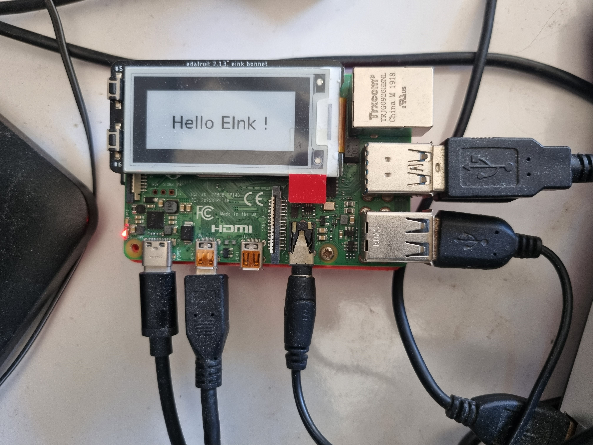

# HTTP/REST Server in Python

## LIS3MDL, magnetometer sensor
To start the server:
```
$ python src/main/python/lis3mdl/server/lis2mdl_server.py [--verbose:true] [--port:8888] [--machine-name:192.168.1.106]
```

Then any client (like `curl`) can perform a REST request, like
```
$ $ curl -X GET http://192.168.1.106:8080/lis3mdl/cache | jq
  % Total    % Received % Xferd  Average Speed   Time    Time     Time  Current
                                 Dload  Upload   Total   Spent    Left  Speed
100   103    0   103    0     0   4093      0 --:--:-- --:--:-- --:--:--  5421
{
  "x": -135.89593686056708,
  "y": 19.701841566793334,
  "z": -57.92166033323589,
  "hdg": 171.75088018189055
}
```

As an example, we also have a Java client, `http.MagnetometerReader.java`.  
Build it with a 
```
$ ../../gradlew shadowJar
```
and run it with
```
$ ./run.client.sh
Heading: 172.124199 Pitch: 161.982753, Roll: -113.040215
Heading: 172.124199 Pitch: 161.982753, Roll: -113.040215
Heading: 172.124199 Pitch: 161.982753, Roll: -113.040215
Heading: 172.124199 Pitch: 161.982753, Roll: -113.040215
Heading: 172.124199 Pitch: 161.982753, Roll: -113.040215
Heading: 172.124199 Pitch: 161.982753, Roll: -113.040215
Heading: 172.124199 Pitch: 161.982753, Roll: -113.040215
Heading: 172.124199 Pitch: 161.982753, Roll: -113.040215
Heading: 172.124199 Pitch: 161.982753, Roll: -113.040215
. . . 
```

## Actuators
### 2.13" eink bonnet
Start the server:
```
$ python src/main/python/eink-2.13/server/eink_2.13_server.py
```
Then, from any REST client like `curl`:
```
$ curl -X POST http://localhost:8080/eink2_13/display -d "Hello EInk !"
```
The text is displayed on the screen!  


### TODO. Motor drivers, oled screens, etc.
