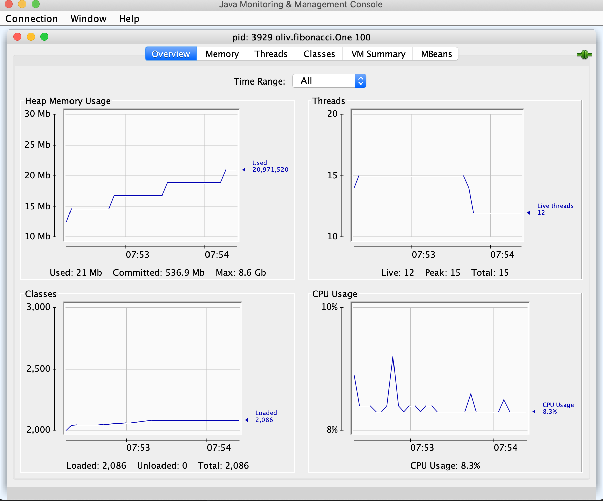
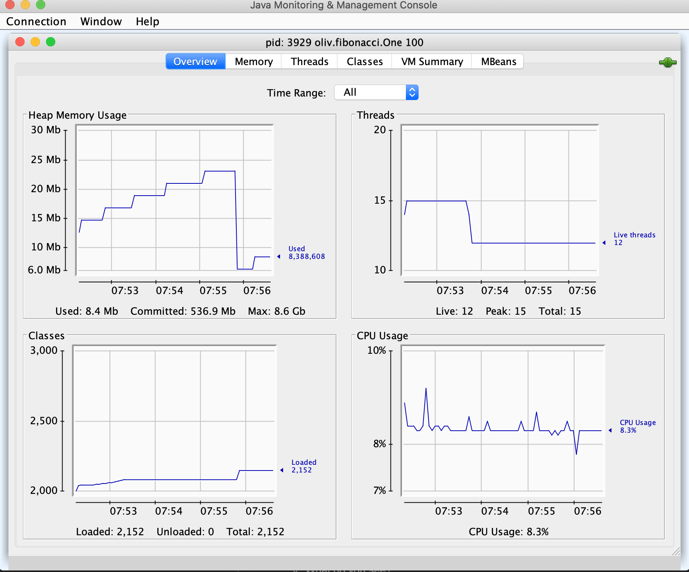
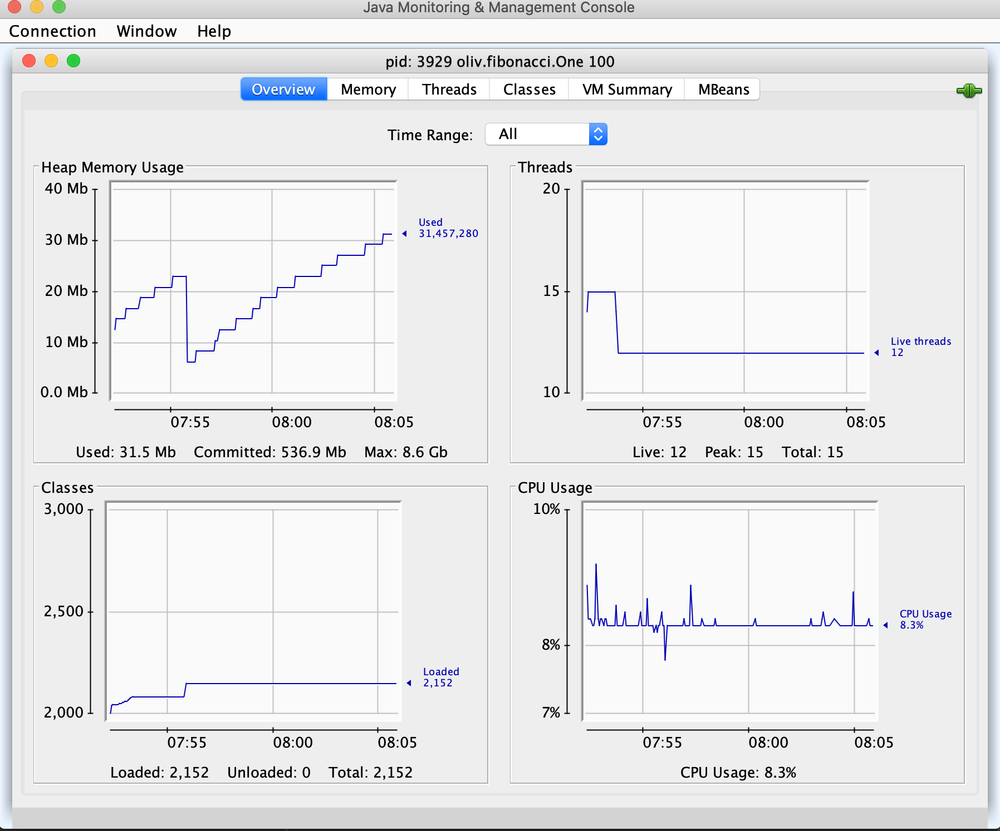
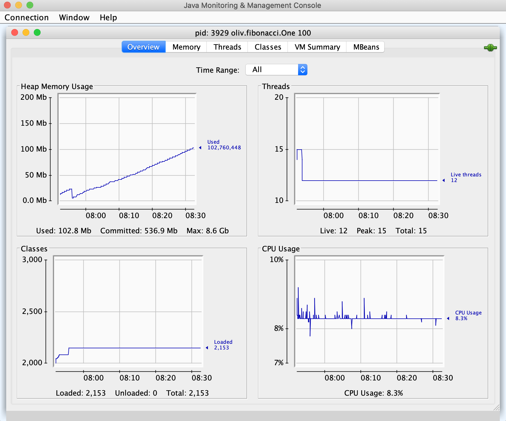

# Quizzzzzzz!

### Fibonacci Suite
- Look in `oliv.fibonacci.One.java`
  - Why doesn't the line `length = Integer.parseInt(args[0]);` require a try-catch block?  
- Compile it
  - `javac -d classes -s src/main/java src/main/java/oliv/fibonacci/*.java`
- Run it
  - `java -cp classes oliv.fibonacci.One`
- Time it
  - `time java -cpclasses oliv.fibonacci.One`
- About the method with signature `private static long fibonacci(int n)`
  - What do you think? Comment.
- About the code:
  ```java
  String result = suite.stream()
                .map(NumberFormat.getInstance()::format)
                .collect(Collectors.joining(", "));
  ```
  what does it mean, what does it do?
- Monitor it with `jconsole`
  - `java -cp classes oliv.fibonacci.One 100`
  - `jconsole`
    
    
    
    
  - What do you see?
  - What's going to happen?
  - How can you fix that?
    - Increase heap size? `-Xms64M -Xmx1G`?
    - Rewrite the code?
  
- See `oliv.fibonacci.Two.java`
  - `time java -cp classes oliv.fibonacci.Two 100`
  
## Bonus: Distribute the binaries
  - Compile the code
  - Jar it
    - With a manifest
  
```
$ rm -rf classes
$ javac -d classes -s src/main/java src/main/java/oliv/fibonacci/*.java
$ mkdir dist
$ echo "Main-Class: oliv.fibonacci.Two" >> manifest.txt
$ cd classes
$ jar -cfm ../dist/fibonacci.jar ../manifest.txt *
$ cd ../dist
$ java -jar fibonacci.jar 50
Computation done in 31 ms:
[0, 1, 1, 2, 3, 5, 8, 13, 21, 34, 55, 89, 144, 233, 37. . .
```

### Chat Server
See the following classes:
- `oliv.events.ServerInterface`
- `oliv.events.ChatTCPServer`
- `oliv.events.ChatTCPClient`
- `oliv.events.server`
- `oliv.events.client`

Put it to work:
```
$ javac -d classes -s src/main/java src/main/java/oliv/events/*.java
```
From a terminal, start the server:
```
$ java -cp classes oliv.events.server --server-verbose:false
```
And then, from two other terminals:
```
$ java -cp classes oliv.events.client --client-name:One
```
```
$ java -cp classes oliv.events.client --client-name:Two
```
From each client, whatever is entered in the console (terminated by `[Return]`) is sent to all other connected clients.

#### What do you think?
- In `ChatTCPClient`, what in the `messageConsumer` method, why is that implemented this way?
- In `ChatTCPServer`, is the `clientMap` thread safe? Does is prevent `ConcurrrentAccessException`?
- Is there any possible memory leak in the server code?
- In the `client`, around line 34, the code says
  ```java
  try {
      Thread.sleep(1_000L); 
  } catch (InterruptedException ie) {
      ie.printStackTrace();
  }
  ```
  How would you do something more elegant and efficient?

##### Package client and server for distribution
Server:
```
$ rm -rf classes
$ rm -rf dist
$ javac -d classes -s src/main/java \
        src/main/java/oliv/events/ServerInterface.java \
        src/main/java/oliv/events/ChatTCPServer.java \
        src/main/java/oliv/events/server.java 
$ mkdir dist
$ echo "Main-Class: oliv.events.server" > manifest.txt
$ cd classes
$ jar -cfm ../dist/server.jar ../manifest.txt *
$ cd ../dist
$ java -jar server.jar --server-verbose:false --server-port:8000
Use [Ctrl-C] to exit.
Chat server started on port 8000.
. . .
```

Client:
```
$ # rm -rf classes
$ # rm -rf dist
$ javac -cp ./dist/server.jar \
        -d classes -s src/main/java \
        src/main/java/oliv/events/ChatTCPClient.java \
        src/main/java/oliv/events/client.java 
$ # mkdir dist
$ echo "Main-Class: oliv.events.client" > manifest.txt
$ cd classes
$ jar -cfm ../dist/client.jar ../manifest.txt *
$ cd ../dist
$ java -jar client.jar --client-name:XXX --server-port:8000 --server-name:localhost
>>> Telling server who I am: I_AM:XXX
Q or QUIT to quit
WHO_S_THERE to know who's there
Anything else will be broadcasted
> _
. . .
```
