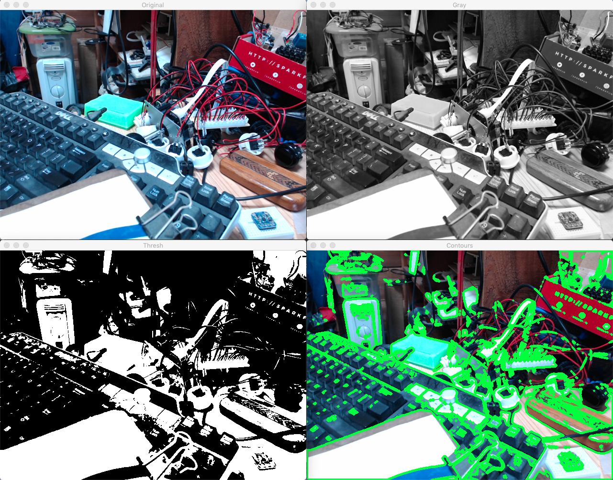

> Great resource [here](https://docs.opencv.org/master/d9/df8/tutorial_root.html),
> samples in 3 languages: C++, Java, Python.

- [OpenCV Python tutorials](https://opencv-python-tutroals.readthedocs.io/en/latest/py_tutorials/py_tutorials.html).
- [More OpenCV, with samples](https://github.com/kipr/opencv)

For help on OpenCV:
```buildoutcfg
$ python
Python 3.7.0 (default, Jun 28 2018, 07:39:16) 
...
Type "help", "copyright", "credits" or "license" for more information.
>>> import cv2
>>> help(cv2)

>>> 
```

### `cam.test.01.py`, Basics. Take a snapshot and save it.

### `cam.test.02.py`, Video test.
With image size setting (width & height).

### `cam.test.03.py`, Take snapshot, display info.

### `cam.test.04.py`, Contour detection




### `cam.test.05.py`, Color detection, get started

### `cam.test.06.py`, Color detection, Act 2

### `detection.1.py`, Hough algorithms, getting started

### `detection.2.py`, Hough algorithms, WIP

### `detection.3.py`, Hough algorithms, Non Probabilistic

### `detection.4.py`, Hough algorithms, Circle Detection

### `detection.5.py`, Path detection, contours approach

### `detection.6.py`, Path detection, pixel approach, not bad!
On only one static image. Will implement camera later.

### `detection.7.py`, Path detection, pixel approach, with camera
Like `detection.6.py`, with a camera.

| Path detection with a camera |
|:-----------------------------:|
|  |

The path is plotted on the image, the courses are displayed in the background terminal.
Those information would be sufficient to drive the robot carrying the camera. 

---

Also check [this](https://towardsdatascience.com/object-detection-with-10-lines-of-code-d6cb4d86f606) out..., Object detection.
and [this](https://towardsdatascience.com/simple-guide-to-hyperparameter-tuning-in-neural-networks-3fe03dad8594)

---

### Following a path

Resources at
- https://www.youtube.com/watch?v=ZC4VUt1I5FI and https://github.com/CRM-UAM/VisionRace
- https://lejosnews.wordpress.com/2015/12/03/line-following-with-opencv/
- https://www.hackster.io/Rjuarez7/line-tracking-with-raspberry-pi-3-python2-and-open-cv-9a9327
- https://github.com/naokishibuya/car-finding-lane-lines
- https://www.youtube.com/watch?v=Z5_8Va8QxnY (no openCV, using light sensors)

### Face recognition
- https://www.hackster.io/Rjuarez7/raspberry-pi-3-face-detection-in-python-2-and-opencv-2-2b06bf

### OpenCV Image manipulation
Very good paper:
- https://likegeeks.com/python-image-processing/

### Object recognition (classification)
See [Here](./object.detection/README.md)

##### Glossary:
- ROI: Region Of Interest
- PID algorithm: proportional-integral-derivative
