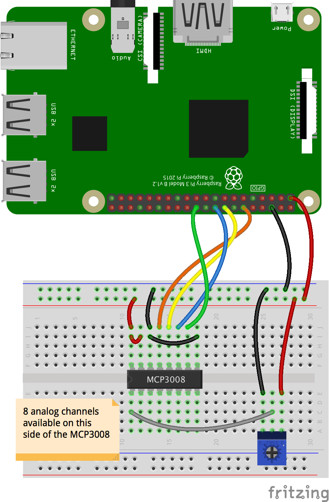
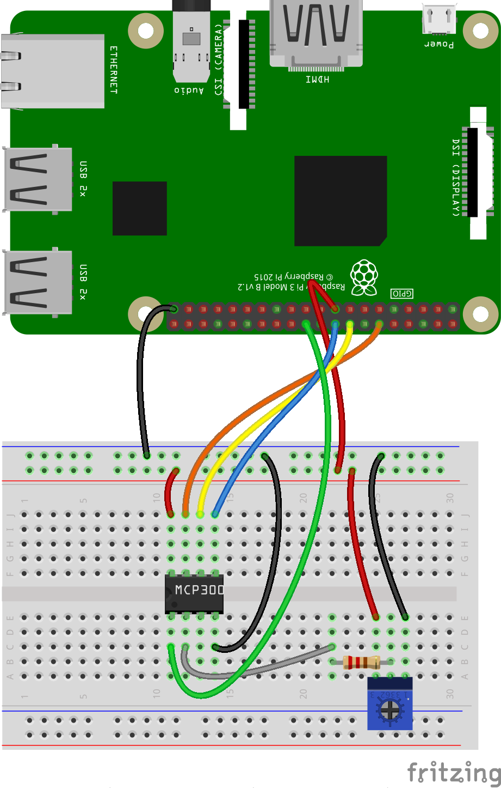

# MCP3008 & MCP3002
### 10 bits Analog to Digital Converter

- [MCP3002 Datasheet](http://ww1.microchip.com/downloads/en/DeviceDoc/21294C.pdf)
- [MCP3008 Datasheet](https://cdn-shop.adafruit.com/datasheets/MCP3008.pdf)

A Java library to read the MCP3008 and MCP3002 ADCs

> _**Warning**_: Some pin direction may change from one model of Raspberry Pi to another...  
> Raspberry Pi 4's pin BCM 8 seems not to be suitable for CS... Hence the CLI parameters below.
```
$ ../gradlew shadowJar
. . .
$ ./adcreader.3008.sh --miso:23 --mosi:24 --clk:18 --cs:25 --channel:0
Read an ADC, MCP3008
No remote debugging activated
Output of gpio readall:
 +-----+-----+---------+------+---+---Pi 4B--+---+------+---------+-----+-----+
 | BCM | wPi |   Name  | Mode | V | Physical | V | Mode | Name    | wPi | BCM |
 +-----+-----+---------+------+---+----++----+---+------+---------+-----+-----+
 |     |     |    3.3v |      |   |  1 || 2  |   |      | 5v      |     |     |
 |   2 |   8 |   SDA.1 | ALT0 | 1 |  3 || 4  |   |      | 5v      |     |     |
 |   3 |   9 |   SCL.1 | ALT0 | 1 |  5 || 6  |   |      | 0v      |     |     |
 |   4 |   7 | GPIO. 7 |   IN | 1 |  7 || 8  | 1 | ALT5 | TxD     | 15  | 14  |
 |     |     |      0v |      |   |  9 || 10 | 1 | ALT5 | RxD     | 16  | 15  |
 |  17 |   0 | GPIO. 0 |   IN | 0 | 11 || 12 | 0 | OUT  | GPIO. 1 | 1   | 18  |
 |  27 |   2 | GPIO. 2 |   IN | 0 | 13 || 14 |   |      | 0v      |     |     |
 |  22 |   3 | GPIO. 3 |   IN | 0 | 15 || 16 | 0 | IN   | GPIO. 4 | 4   | 23  |
 |     |     |    3.3v |      |   | 17 || 18 | 0 | OUT  | GPIO. 5 | 5   | 24  |
 |  10 |  12 |    MOSI |  OUT | 0 | 19 || 20 |   |      | 0v      |     |     |
 |   9 |  13 |    MISO | ALT0 | 0 | 21 || 22 | 1 | OUT  | GPIO. 6 | 6   | 25  |
 |  11 |  14 |    SCLK |  OUT | 0 | 23 || 24 | 1 | OUT  | CE0     | 10  | 8   |
 |     |     |      0v |      |   | 25 || 26 | 1 | OUT  | CE1     | 11  | 7   |
 |   0 |  30 |   SDA.0 |   IN | 1 | 27 || 28 | 1 | IN   | SCL.0   | 31  | 1   |
 |   5 |  21 | GPIO.21 |   IN | 1 | 29 || 30 |   |      | 0v      |     |     |
 |   6 |  22 | GPIO.22 |   IN | 1 | 31 || 32 | 0 | IN   | GPIO.26 | 26  | 12  |
 |  13 |  23 | GPIO.23 |   IN | 0 | 33 || 34 |   |      | 0v      |     |     |
 |  19 |  24 | GPIO.24 |   IN | 0 | 35 || 36 | 0 | IN   | GPIO.27 | 27  | 16  |
 |  26 |  25 | GPIO.25 |   IN | 0 | 37 || 38 | 0 | IN   | GPIO.28 | 28  | 20  |
 |     |     |      0v |      |   | 39 || 40 | 0 | IN   | GPIO.29 | 29  | 21  |
 +-----+-----+---------+------+---+----++----+---+------+---------+-----+-----+
 | BCM | wPi |   Name  | Mode | V | Physical | V | Mode | Name    | wPi | BCM |
 +-----+-----+---------+------+---+---Pi 4B--+---+------+---------+-----+-----+
------------------------------------------------------------------------------
Running sudo java -cp ./build/libs/ADC-1.0-all.jar  -Dadc.verbose=false -Ddisplay.digit=false  analogdigitalconverter.sample.MainMCP3008Sample --miso:23 --mosi:24 --clk:18 --cs:25 --channel:0
------------------------------------------------------------------------------
Running on: Model: 4B, PCB Rev 1.1, Memory 4GB, Manufactured by Sony UK
Usage is java analogdigitalconverter.sample.MainMCP3008Sample --miso:9 --mosi:10 --clk:11 --cs:8 --channel:0
Values above are default values (GPIO/BCM numbers).
Pins: 9 (GPIO 13) 10 (GPIO 12) 11 (GPIO 14) 8 (GPIO 10)

Reading MCP3008 on channel 0
 Wiring of the MCP3008-SPI (without power supply):
 +---------++-------------------------------------------------+
 | MCP3008 || Raspberry Pi                                    |
 +---------++------+--------------+------+---------+----------+
 |         || Pin# | Name         | Role | GPIO    | wiringPI |
 |         ||      |              |      | /BCM    | /PI4J    |
 +---------++------+--------------+------+---------+----------+
 | CLK (13)|| #12  | PCM_CLK/PWM0 | CLK  | GPIO_18 | 01       |
 | Din (11)|| #18  | GPIO_5       | MOSI | GPIO_24 | 05       |
 | Dout(12)|| #16  | GPIO_4       | MISO | GPIO_23 | 04       |
 | CS  (10)|| #22  | GPIO_6       | CS   | GPIO_25 | 06       |
 +---------++------+--------------+-----+----------+----------+
Raspberry Pi is the Master, MCP3008 is the Slave:
- Dout on the MCP3008 goes to MISO on the RPi
- Din on the MCP3008 goes to MOSI on the RPi
Pins on the MCP3008 are numbered from 1 to 16, beginning top left, counter-clockwise.
       +--------+ 
* CH0 -+  1  16 +- Vdd 
  CH1 -+  2  15 +- Vref 
  CH2 -+  3  14 +- aGnd 
  CH3 -+  4  13 +- CLK 
  CH4 -+  5  12 +- Dout 
  CH5 -+  6  11 +- Din 
  CH6 -+  7  10 +- CS 
  CH7 -+  8   9 +- dGnd 
       +--------+ 
       +-----+-----+--------------+-----++-----+--------------+-----+-----+
       | BCM | wPi | Name         |  Physical  |         Name | wPi | BCM |
       +-----+-----+--------------+-----++-----+--------------+-----+-----+
       |     |     | 3v3          | #01 || #02 |          5v0 |     |     |       
       |  02 |  08 | SDA1         | #03 || #04 |          5v0 |     |     |       
       |  03 |  09 | SCL1         | #05 || #06 |          GND |     |     |       
       |  04 |  07 | GPCLK0       | #07 || #08 |    UART0_TXD | 15  | 14  |       
       |     |     | GND          | #09 || #10 |    UART0_RXD | 16  | 15  |       
       |  17 |  00 | GPIO_0       | #11 || #12 | PCM_CLK/PWM0 | 01  | 18  | CLK   
       |  27 |  02 | GPIO_2       | #13 || #14 |          GND |     |     |       
       |  22 |  03 | GPIO_3       | #15 || #16 |       GPIO_4 | 04  | 23  | Dout  
       |     |     | 3v3          | #17 || #18 |       GPIO_5 | 05  | 24  | Din   
       |  10 |  12 | SPI0_MOSI    | #19 || #20 |          GND |     |     |       
       |  09 |  13 | SPI0_MISO    | #21 || #22 |       GPIO_6 | 06  | 25  | CS    
       |  11 |  14 | SPI0_CLK     | #23 || #24 |   SPI0_CS0_N | 10  | 08  |       
       |     |     | GND          | #25 || #26 |   SPI0_CS1_N | 11  | 07  |       
       |  00 |  30 | SDA0         | #27 || #28 |         SCL0 | 31  | 01  |       
       |  05 |  21 | GPCLK1       | #29 || #30 |          GND |     |     |       
       |  06 |  22 | GPCLK2       | #31 || #32 |         PWM0 | 26  | 12  |       
       |  13 |  23 | PWM1         | #33 || #34 |          GND |     |     |       
       |  19 |  24 | PCM_FS/PWM1  | #35 || #36 |      GPIO_27 | 27  | 16  |       
       |  26 |  25 | GPIO_25      | #37 || #38 |      PCM_DIN | 28  | 20  |       
       |     |     | GND          | #39 || #40 |     PCM_DOUT | 29  | 21  |       
       +-----+-----+--------------+-----++-----+--------------+-----+-----+
       | BCM | wPi | Name         |  Physical  |         Name | wPi | BCM |
       +-----+-----+--------------+-----++-----+--------------+-----+-----+
Volume:80% (821)
Volume:78% (804)
Volume:75% (770)
Volume:72% (742)
Volume:70% (726)
Volume:68% (699)
Volume:66% (678)
Volume:65% (672)
Volume:67% (686)
Volume:71% (727)
Volume:74% (762)
Volume:76% (785)
Volume:77% (793)
^CShutting down.
pi@raspi-8gb-RAM:~/repos/raspberry-coffee/raspberry-io-pi4j/ADC (master) $ ...
```

### Example


> ⚠️ If the MCP3008's Vdd and Vin use the Raspberry Pi's 5V, a resistor (220 &Omega; here) on the potentiometer is important.
> No need for it if Vdd and Vin are connected on the Raspberry Pi's 3V3 (as on the diagram above).

On the diagram above,
- The `MCP3008`'s `CLK` (`#13`) is connected on the RPi's `PCM_CLK` (`BCM 18`, `Physical #12`) - Orange wire
- The `MCP3008`'s `Dout` (`#12`) aka `MISO`, is connected on the RPi's `GPIO_4` (`BCM 23`, `Physical #16`) - Yellow wire
- The `MCP3008`'s `Din` (`#11`) aka `MOSI`, is connected on the RPi's `GPIO_5` (`BCM 24`, `Physical #18`) - Blue wire
- The `MCP3008`'s `CS` (`#10`) is connected on the RPi's `GPIO_6` (`BCM 25`, `Physical #22`) - Green wire

> As mentioned in the console, pin numbers are **BCM** numbers.

> The pins above (on the Raspberry Pi) are the default ones for the `ADCObserver`.

You can then use the script `one.channel.sh`:
```
 $ ./one.channel.sh
```

The `./adcreader.3008.sh` command would be issued like
```
 $ ./adcreader.3008.sh --miso:23 --mosi:24 --clk:18 --cs:25 --channel:0
```

### MCP3002 version

WIP. See [here](https://learn.sparkfun.com/tutorials/python-programming-tutorial-getting-started-with-the-raspberry-pi/experiment-3-spi-and-analog-input)



> ⚠️ The resistor (220 &Omega; here) on the potentiometer is important! 

On the diagram above,
- The `MCP3002`'s `CLK` (`#7`) is connected on the RPi's `PCM_CLK` (`#12`) - Orange wire
- The `MCP3002`'s `Dout` (`#6`) aka `MISO`, is connected on the RPi's `GPIO_4` (`#16`) - Yellow wire
- The `MCP3002`'s `Din` (`#5`) aka `MOSI`, is connected on the RPi's `GPIO_5` (`#18`) - Blue wire
- The `MCP3002`'s `CS` (`#1`) is connected on the RPi's `GPIO_6` (`#22`) - Green wire

> Again, as mentioned in the console, pin numbers are **BCM** numbers.

The `./adcreader.3002.sh` command would be issued like
```
 $ ./adcreader.3002.sh --miso:23 --mosi:24 --clk:18 --cs:25 --channel:0
Read an ADC
Usage is java analogdigitalconverter.sample.MainMCP3002Sample --miso:9 --mosi:10 --clk:11 --cs:8 --channel:0
Values above are default values (GPIO/BCM numbers).

Reading MCP3002 on channel 0
 Wiring of the MCP3002-SPI (without power supply):
 +---------++-------------------------------------------------+
 | MCP3002 || Raspberry Pi                                    |
 +---------++------+--------------+------+---------+----------+
 |         || Pin# | Name         | Role | GPIO    | wiringPI |
 |         ||      |              |      | /BCM    | /PI4J    |
 +---------++------+--------------+------+---------+----------+
 | CLK (7) || #12  | PCM_CLK/PWM0 | CLK  | GPIO_18 | 01       |
 | Din (6) || #18  | GPIO_5       | MOSI | GPIO_24 | 05       |
 | Dout(5) || #16  | GPIO_4       | MISO | GPIO_23 | 04       |
 | CS  (1) || #22  | GPIO_6       | CS   | GPIO_25 | 06       |
 +---------++------+--------------+-----+----------+----------+
Raspberry Pi is the Master, MCP3002 is the Slave:
- Dout on the MCP3002 goes to MISO on the RPi
- Din on the MCP3002 goes to MOSI on the RPi
Pins on the MCP3002 are numbered from 1 to 8, beginning top left, counter-clockwise.
       +------+ 
   CS -+ 1  8 +- Vdd/Vref 
* CH0 -+ 2  7 +- CLK 
  CH1 -+ 3  6 +- Dout 
  Vss -+ 4  5 +- Din 
       +------+ 
       +-----+-----+--------------+-----++-----+--------------+-----+-----+
       | BCM | wPi | Name         |  Physical  |         Name | wPi | BCM |
       +-----+-----+--------------+-----++-----+--------------+-----+-----+
       |     |     | 3v3          | #01 || #02 |          5v0 |     |     |       
       |  02 |  08 | SDA1         | #03 || #04 |          5v0 |     |     |       
       |  03 |  09 | SCL1         | #05 || #06 |          GND |     |     |       
       |  04 |  07 | GPCLK0       | #07 || #08 |    UART0_TXD | 15  | 14  |       
       |     |     | GND          | #09 || #10 |    UART0_RXD | 16  | 15  |       
       |  17 |  00 | GPIO_0       | #11 || #12 | PCM_CLK/PWM0 | 01  | 18  | CLK   
       |  27 |  02 | GPIO_2       | #13 || #14 |          GND |     |     |       
       |  22 |  03 | GPIO_3       | #15 || #16 |       GPIO_4 | 04  | 23  | Dout  
       |     |     | 3v3          | #17 || #18 |       GPIO_5 | 05  | 24  | Din   
       |  10 |  12 | SPI0_MOSI    | #19 || #20 |          GND |     |     |       
       |  09 |  13 | SPI0_MISO    | #21 || #22 |       GPIO_6 | 06  | 25  | CS    
       |  11 |  14 | SPI0_CLK     | #23 || #24 |   SPI0_CS0_N | 10  | 08  |       
       |     |     | GND          | #25 || #26 |   SPI0_CS1_N | 11  | 07  |       
       |     |  30 | SDA0         | #27 || #28 |         SCL0 | 31  |     |       
       |  05 |  21 | GPCLK1       | #29 || #30 |          GND |     |     |       
       |  06 |  22 | GPCLK2       | #31 || #32 |         PWM0 | 26  | 12  |       
       |  13 |  23 | PWM1         | #33 || #34 |          GND |     |     |       
       |  19 |  24 | PCM_FS/PWM1  | #35 || #36 |      GPIO_27 | 27  | 16  |       
       |  26 |  25 | GPIO_25      | #37 || #38 |      PCM_DIN | 28  | 20  |       
       |     |     | GND          | #39 || #40 |     PCM_DOUT | 29  | 21  |       
       +-----+-----+--------------+-----++-----+--------------+-----+-----+
       | BCM | wPi | Name         |  Physical  |         Name | wPi | BCM |
       +-----+-----+--------------+-----++-----+--------------+-----+-----+
. . .
```


