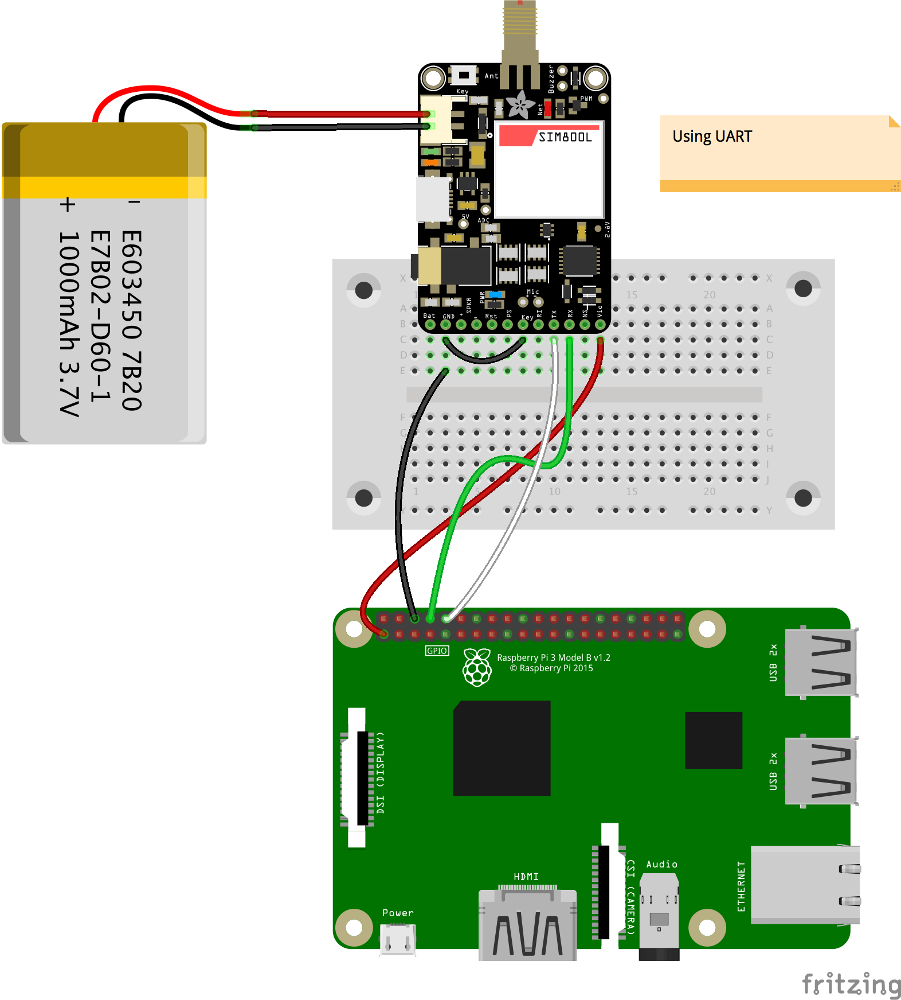
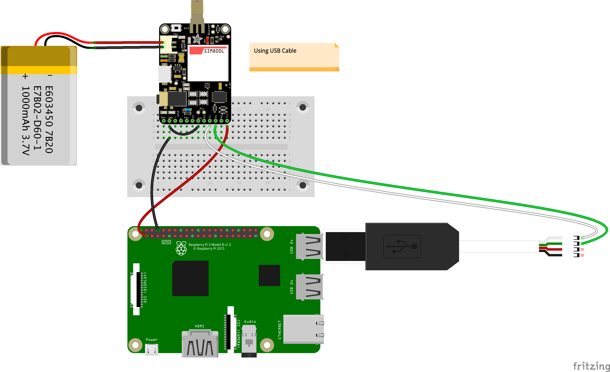

## FONA in Java
> FONA is using a Serial interface, No SPI, no I2C.

### An important detail
Using the PI4J `com.pi4j.io.Serial` package, I was not able to write more than 16 characters to the Serial output.
A code like this one:
```
String payload = "ABCDEFGHIJKLMNOPQRSTUVWXYZ";
serial.writeln(payload);
```
will result in an output like `"ABCDEFGHIJKLMNOP"` on the receiver's end.
I've not been able to find why, but this is a fact.

Waiting 1 millisecond between each character sent to the Serial port seems to address the issue:
```java
private final static float BETWEEN_SENT_CHAR = 0.001F; // 1 ms
...
String payload = "ABCDEFGHIJKLMNOPQRSTUVWXYZ";
for (int i=0; i<payload.length(); i++) {
  serial.write(payload.charAt(i));
  delay(BETWEEN_SENT_CHAR);
}
```
The code above works as expected. The `delay` method is defined in the code, it is a wrapper around `Thread.sleep`.

### Two approaches
This project contains two parts, each of them illustrating a way to access the FONA:
* One is using the Serial connection between the Raspberry Pi and the Arduino where the FONA is connected
* One is using the Serial connection directly to the FONA.

For the first approach, see the package named `fona.arduino`, for the second one, see the package named `fona.manager`.

#### First approach: Arduino
The first approach is straightforward. It requires the sketch `FONA_for_RPi.ino` to be uploaded on the Arduino.

#### Second approach: direct
The second approach does not require an Arduino, I find it more interesting, as none of the real-time capabilities
provided by an Arduino are required in the FONA context.

See an example of a client in `fona.pi4jmanager.sample.InteractiveFona.java`. It requires the client
to implement the `fona.pi4jmanager.FONAClient` interface, mostly for the callbacks.

##### December 2017
Adding the possibility to access the FONA from the `LibRxTx` API.
This allows other machines than the Raspberry Pi to access the FONA.

> Quick note: on a Mac, you might need to install [Prolific drivers](https://plugable.com/drivers/prolific/).

### What Serial port, UART or another one?
 To use `/dev/ttyAMA0`, you need to disable the Serial Shell (from `raspi-config`).



 In case you do not want to - or cannot - use the UART port (`/dev/ttyAMA0`) it is easy to
 use another port - like a USB slot. You just need a USB cable like the
 one at https://www.adafruit.com/products/954.

 - Hook-up the green wire of the USB cable on the FONA Rx
 - Hook-up the white wire of the USB cable on the FONA Tx

You end-up with a serial port like `/dev/ttyUSB*`.



You can as well use the Vin and the GND of the USB cable, it works fine.
This would be another project, a FONA on its own board, with a USB Cable attached to it ;)

> Important: Make sure you've disabled the Serial Console interface in `raspi-config`. The FONA requires access to the Serial port.

> If the FONA's network led (red) is not blinking, you might have to hold down the FONA's reset button for ~2 seconds.


## Implement your own FONA application
See in `FonaListener.java`, this is an example/skeleton of what you need to expect SMS and reply
something the caller expects.
This example just speaks out the message it received.
For this example, you need to have installed `espeak`.
 ```bash
  sudo apt-get install espeak
 ```
To implement your own code, see the method
```java
 @Override
 public void readSMS(FONAManager.ReceivedSMS sms) {
   ...
 }
```

Also see [here](https://github.com/OlivierLD/navigation-desktop-user-exits/blob/master/src/olivsoftdesktopuserexits/FONAUserExit.java), for remote monitoring using FONA.
