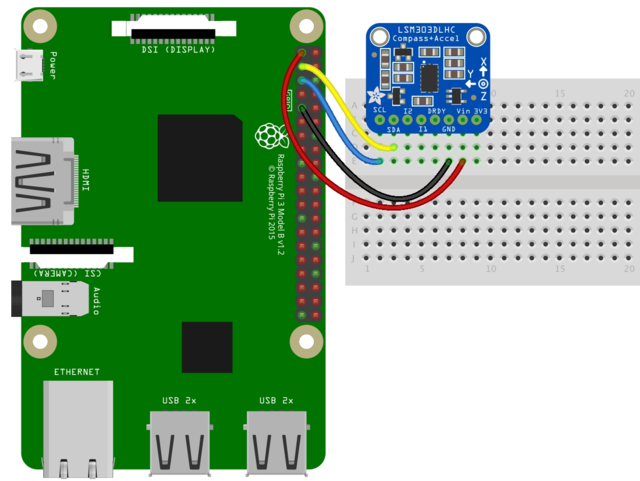
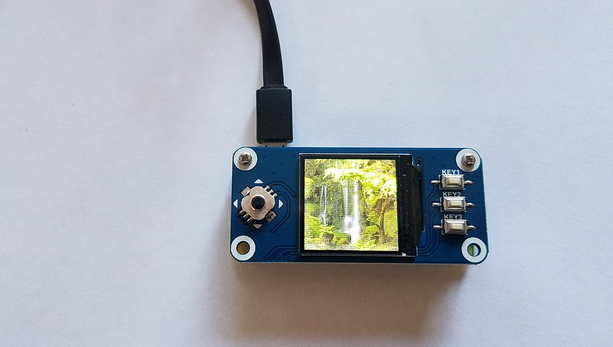
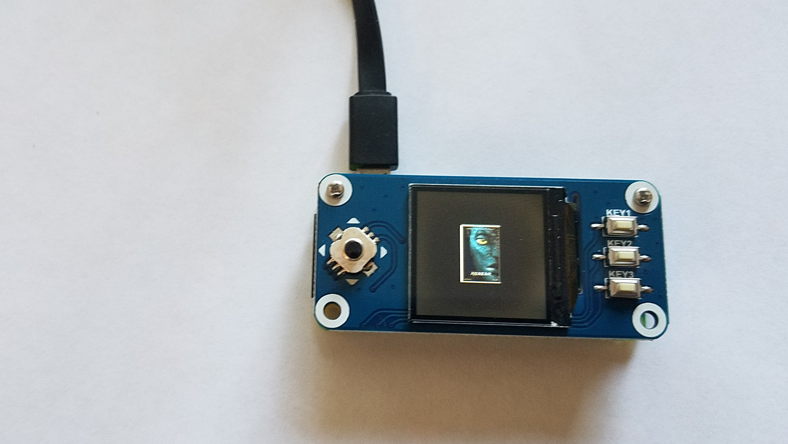
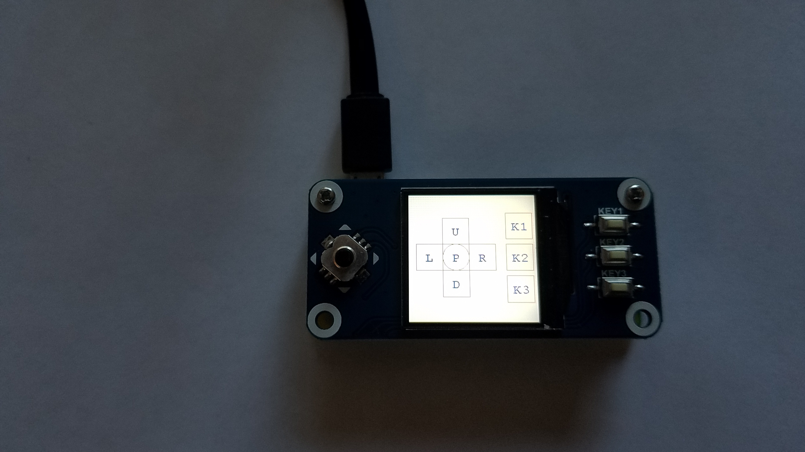
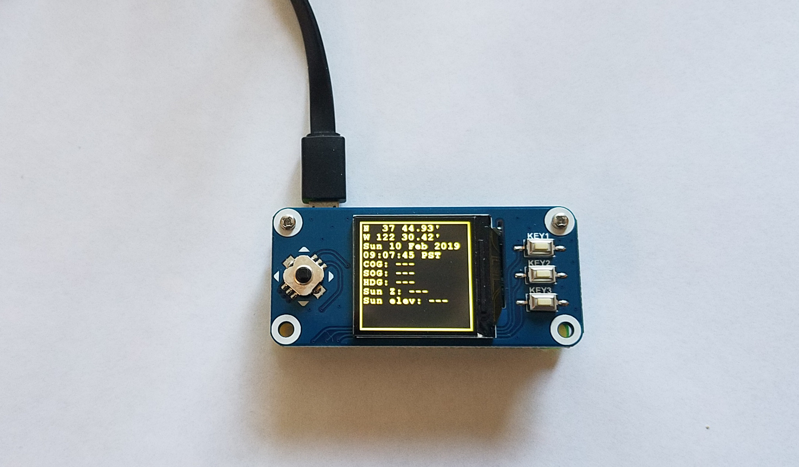
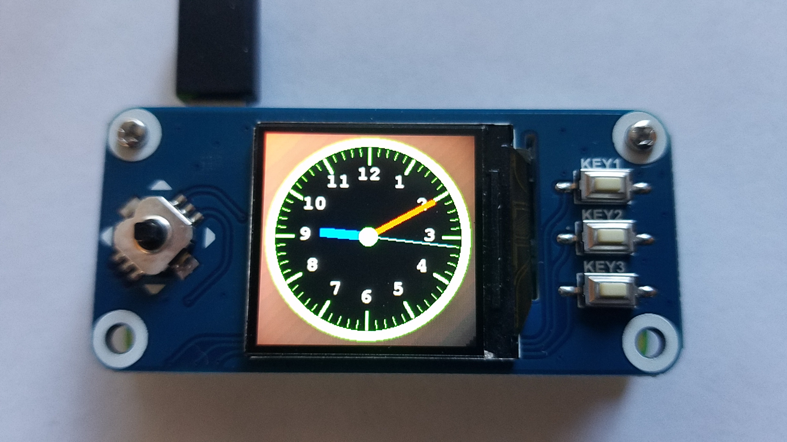

# I<sup>2</sup>C and SPI code and examples

## Sensors

#### BME280, BMP180
I<sup>2</sup>C Pressure, Temperature, Humidity (for BME280)

#### BMP183
SPI Pressure, Temperature

#### HMC5883L
I<sup>2</sup>C 3 axis Compass

#### HTU21DF
I<sup>2</sup>C Humidity & Temperature

#### L3GD20
I<sup>2</sup>C Triple axis Gyroscope

#### LSM303
I<sup>2</sup>C Accelerometer + Magnetometer

There is this [good paper](https://github.com/praneshkmr/node-lsm303/wiki/Understanding-the-calibration-of-the-LSM303-magnetometer-(compass)) about the LSM303 calibration.
See also [that one](./lsm303.calibration/README.md), in this module.
Run the `i2c.sensor.LSM303` with `-Dlsm303.log.for.calibration=true` (see in the script `lsm303.sh`), this will generate a CSV log file you can use in a spreadsheet (like in the document above),
to get the calibration offsets and coefficients.

Also see in the code (`i2c.sensor.LSM303.java`) how to apply those calibration parameters:
```java
  sensor.setCalibrationValue(LSM303.MAG_X_OFFSET, 9);
  sensor.setCalibrationValue(LSM303.MAG_Y_OFFSET, -16);
```


#### MPC9808
I<sup>2</sup>C Temperature

#### MPL115A2
I<sup>2</sup>C Pressure, Temperature

#### TCS34725
I<sup>2</sup>C Light sensor, color sensor

#### TSL2561
I<sup>2</sup>C Light Sensor

#### VCNL4000
I<sup>2</sup>C Proximity sensor

#### VL53L0X
I<sup>2</sup>C Time of Flight Distance

## ADCs

#### ADS1x15
ADS1015 and ADS1115. I<sup>2</sup>C ADCs.

Document: [ADC Benchmark](https://github.com/OlivierLD/raspberry-coffee/blob/master/ADC-benchmark/README.md).

## Servos & Motors

#### PCA9685
I<sup>2</sup>C 16-channel 12-bit PWM/_**Servo driver**_.

From [Adafruit](https://www.adafruit.com/product/815)

About servo calibration, read [this](./PWM.md).

##### Wiring
- Board 3.3V to sensor VCC
- Board GND to sensor GND
- Board SCL to sensor SCL
- Board SDA to sensor SDA

A `5v` power supply is required to feed the servos. 
- the [Female DC power adapter](http://adafru.it/368) works fine
- I was also able to power it from the Raspberry Header (pins #2 and #39) for 2 servos without problem.


#### Adafruit Motor HAT
I<sup>2</sup>C, DC and Stepper Motors.

From [Adafruit](https://www.adafruit.com/product/2348)

Requires an external power supply (5-12v).

[NEMA-17 diagrams & Docs](https://www.circuitspecialists.com/nema_17_stepper_motor_42bygh4807.html). 

## Screens

#### SSD1306 (SPI and I<sup>2</sup>C)
128x32 and 128x64 OLED monochrome screens, https://www.adafruit.com/product/3527, https://www.adafruit.com/product/931, and https://www.adafruit.com/product/661,
https://www.adafruit.com/product/326, https://www.adafruit.com/product/938.

> _Note_: **June 2021**: Possible problems with SPI versions (GPIO) with recent RaspiOS versions...  
> I was able to run it OK on Buster, but do NOT do an `apt upgrade`. `apt update` seems OK.

Run `ssd1306_128x64.sh` will display (on option) data in the screen and on the console.
```
                                                                                                                                
                   X                                                                                                            
                   X                                                                                                            
                  XX                                                                                                            
                  XX                                                                                                            
                 XXX                                                                                                            
                XXX                                                                                                             
               XXX  XX                                                                                                          
              XXX XXX                                                                                                           
             XXX XXX                                                                                                            
            XXX XXX                                                                                                             
            XX  XX                                                                                                              
            XX  XX                                                    XXX                                                       
            XX  XXX                 XXXXX                              XX       XXXX                    XX                      
            XXX XXXX                  XX      XXXX XXXXX   XXX   XXX   XX XX     XX  XXX  XXX XXX XXX   XX                      
             XX  XXX                  XX     XXX    XX XX XX XX XX XX  XXXX      XX XX XX  XX XX XX XX  XX                      
              XX XXX                  XX      XXXX  XX XX XXXXX  XXXX  XXX     X XX  XXXX   XXX   XXXX  XX                      
         XXX     XX    XXXX           XX        XXX XX XX XX    XX XX  XXXX    X XX XX XX   XXX  XX XX                          
       XXX       X XXX   XX         XXXXX    XXXXX  XXXX   XXXX XXXXXX XX XX   XXX  XXXXXX   X   XXXXXX XX                      
       XXXXXXXXXXXXXX    XX                         XX                                                                          
             X           XX                        XXXX                                                                         
         XXX      XX    XX                                                                                                      
         XXXXXXXXXXXX  XX                                                                                                       
            XXXXXX                                                                                                              
          XX      X                                                                                                             
          XXXXXXXXXXX                                                                                                           
      XXX   XXXXXXX      X                                                                                                      
     XX                XXX                                                                                                      
     XXXXXXXXXXXXXXXXXXXXXX                                                                                                     
        XXXXXXXXXXXXX XXXXX                                                                                                     
         XXXXXXXXXXXXXXXX                                                                                                       

```

#### Nokia5110
SPI 84x48 Monochrome LCD. https://www.adafruit.com/product/338

#### Waveshare 240x240, 1.3inch IPS LCD display HAT for Raspberry Pi 🌊
Very cool 240x240 _**Color**_ screen, with 3 buttons and a 5-option joystick, https://www.waveshare.com/product/modules/oleds-lcds/raspberry-pi-lcd/1.3inch-lcd-hat.htm,
same size as the Raspberry Pi Zero.

|    |    |
|:--:|:--:|
|  <br/> Graphical Display |  <br/> BMP Image |
|  <br/> Gif image |  <br/> Keys and Joystick listeners |
|  <br/> Character data |  <br/> Analog watch |

Through the Java `ImageIO` package, all image formats are supported.

See the code [here](https://github.com/OlivierLD/raspberry-coffee/tree/master/I2C.SPI/src/spi/lcd/waveshare).

## Miscellaneous
I<sup>2</sup>C communication between Raspberry Pi and Arduino.
Package `i2c.comm`.

## Examples
### MeArm
Requires a `PCA9685`, and 4 servos.

- Basic test, hard-coded in `mearm.sh`
- Scripted demo, see `i2c.samples.MeArmScriptDemo` and the script `mearm.script.sh`, along with the file [`script.01.mearm`](./script.01.mearm).
- Interactive demo (drive the MeArm from your keyboard)
```
$ ./mearm.pilot.inter.sh -left:0 -right:4 -bottom:2 -claw:1
```

See [here](https://github.com/OlivierLD/raspberry-coffee/tree/master/Processing#mearm-gui) for wiring and more details.

... More details to come.


