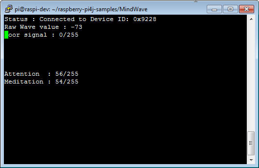
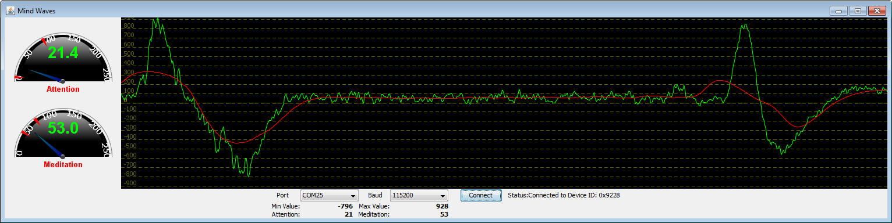
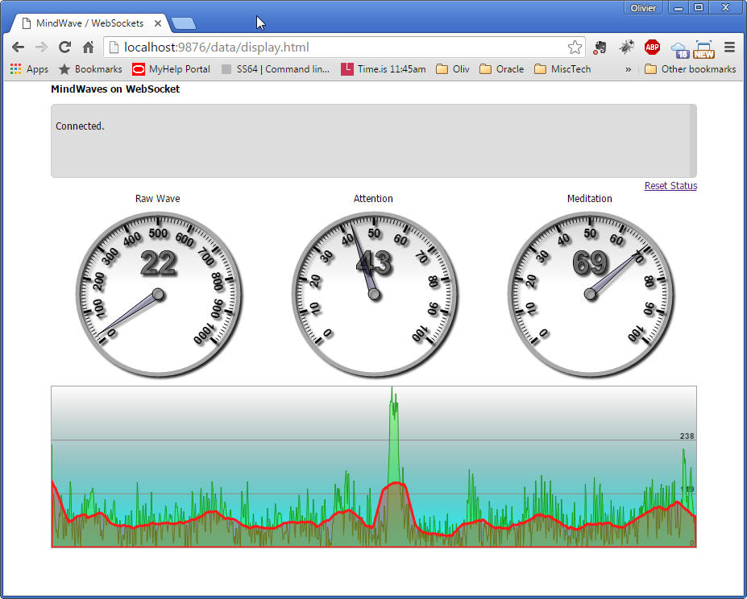

## NeuroSky MindWave
See the [NeuroSky](http://neurosky.com/) web site.

Just plug the dongle in one of the USB ports of the Raspberry Pi, and it just works. I used `/dev/ttyUSB0` with a
baud rate of `115200` in the samples of this project.

There is _asolutely no need_ for BlueTooth or any such technology, all you need is to read the serial port the
dongle is
plugged in.

All the skill is in the class named `mindwave.MindWaveController`. It uses the methods defined
in `mindwvae.MindWaveCallbacks` to send the MindWave data to the client.

Several samples are available, to see how it works.

`mindwave.samples.ClientOne` is a CLI interface, it spits out what it reads on the console.

`mindwave.samples.ClientTwo` provides an Ansi Console interface.

  

The most important thing to make it work is to implement the `mindwave.MindWaveCallbacks` interface.

See how it is done in `ClientOne` and `ClientTwo`.

There is also a rough Swing GUI - a bit too demanding for the Raspberry Pi - that shows what's going on.

  

On the diagram above, the spikes represent eye blinks.
To start it, run the script named `run.gui`, or its equivalent for the system you're on (you'll take care of that,
thank you).

There is also a WebSocket version,running on top of node.js, with a Web UI:

  

